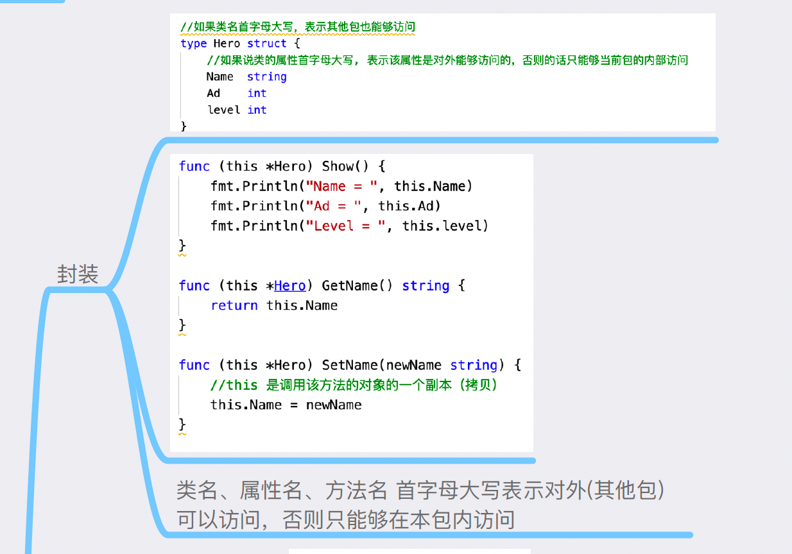
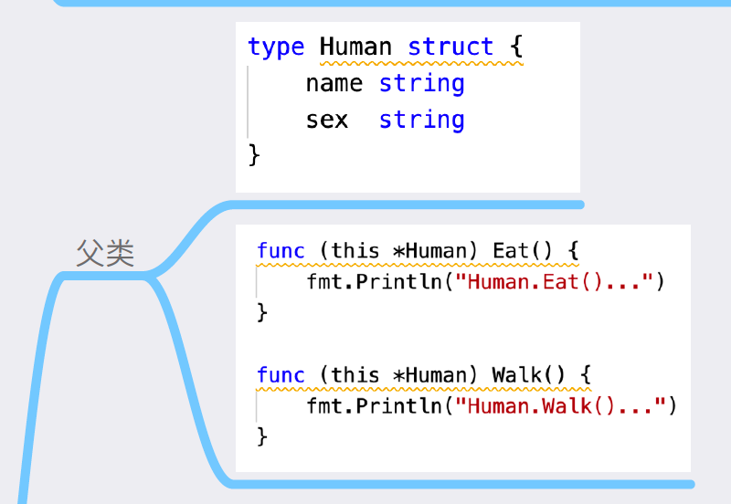
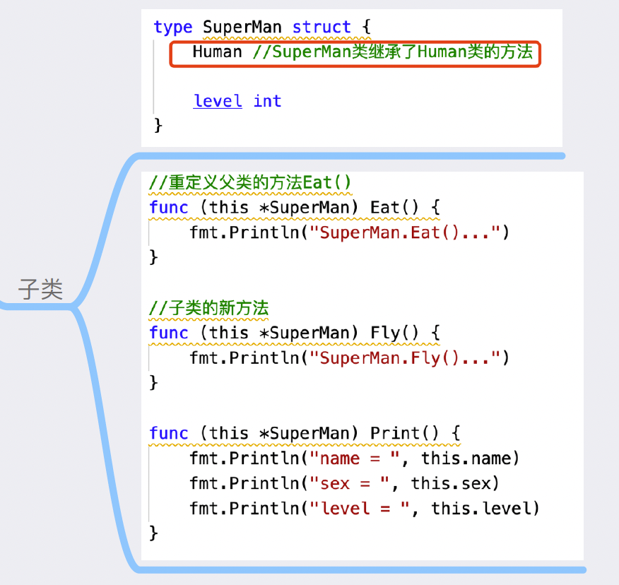
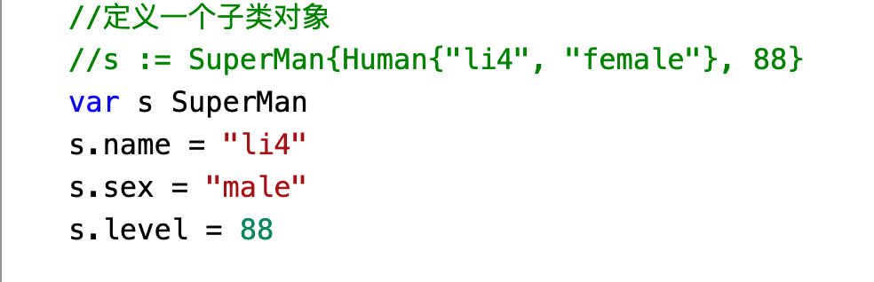
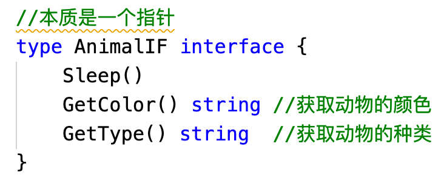
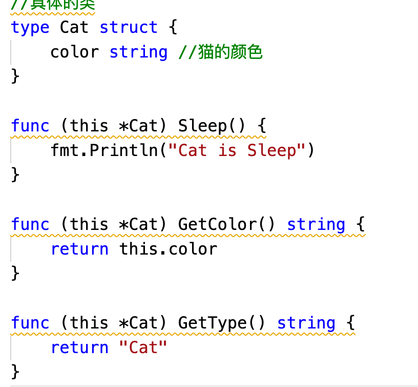
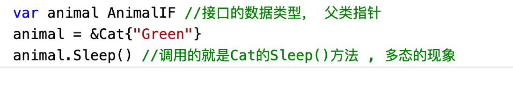

# 一、说明

- 参考资料：
  - [8小时转职Golang工程师](https://www.yuque.com/aceld/mo95lb/dsk886)（视频：https://www.bilibili.com/video/BV1gf4y1r79E?p=1&vd_source=0a39289eadc0da17263e587380c7e5d4）
  - [快学Go语音编程](http://legoserver.bcc-szwg.baidu.com:8072/)（百度内网）
- 语言简介：Go语言是Google开发的一种**静态** **强类型**、**编译型**、**并发型**，并具有垃圾回收功能的编程语言。
- 官方资料
  - 官网：[https://go.dev](https://go.dev/)
  - 源码：https://github.com/golang/go
  - 下载：https://go.dev/dl/ ； https://golang.org/dl/
  - 国内下载（官方）：https://golang.google.cn/dl/


# 五、面向对象

- 面向对象特征：封装、继承、多态

- 结构体/数据类型：==type==；==类 = 结构体 + 方法==

  ```go
  type Hero struct {
  	Name  string
  	Ad    int
  	Level int
    // 私有属性
    some int
  }
  
  // func (hero Hero) Show1() {
  // 	fmt.Println("Name = ", hero.Name)
  // 	fmt.Println("Ad = ", hero.Ad)
  // 	fmt.Println("Level = ", hero.Level)
  // }
  
  // func (hero Hero) GetName1() string {
  // 	return hero.Name
  // }
  
  // func (hero Hero) SetName1(newName string) {
  // 	// 不会改变原对象的属性
  // 	hero.Name = newName
  // }
  
  func (hero *Hero) Show() {
  	fmt.Println("Name = ", hero.Name)
  	fmt.Println("Ad = ", hero.Ad)
  	fmt.Println("Level = ", hero.Level)
  }
  
  func (hero *Hero) GetName() string {
  	return hero.Name
  }
  
  func (hero *Hero) SetName(newName string) {
  	// 改变原对象的属性
  	hero.Name = newName
  }
  ```

- 封装：\*Object传值

  

- 继承

  - 父类

    

  - 子类：父类类型放在子类中，代表继承

    

  - 使用：

    

- 多态

  - ① 接口interface

    

  - ② 子类实现父类全部接口方法（实现了全部接口，就是子类了）

    

  - ③ 使用

    


- 值传递时，是深拷贝还是浅拷贝


# 语言拾遗

## 注意事项

- go严格区分大小写。


## 错误收集

- https://blog.csdn.net/longgeaisisi/article/details/121288696

  


## 小知识

- 『fmt』含义：format（https://stackoverflow.com/questions/23597165/go-meaning-of-the-fmt-package-acronym）


## 整型类型约束

不同整型无法运算

- 如下会报类型错误（这种设计的意义：为了更好的实现**类型推导**的功能；加强开发者对**类型越界**的设计意识）

```go
var a int16
var b int32
fmt.Println(a+b)
// invalid operation: a + b (mismatched types int16 and int32)compilerMismatchedTypes
```


