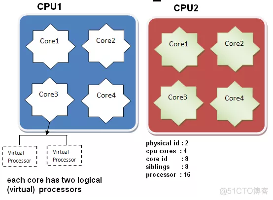
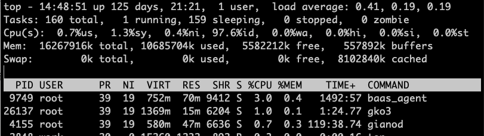

# 常见命令

## 终端命令快捷键

- mac版本

```shell
Ctrl + A / E ：移行首/尾u
Ctrl + U：删除光标前全部
Ctrl + K：删除光标后的全部
Ctrl + W：删除光标前一个单词（部分机器 Option + Delete也可）
Ctrl + "-"：撤销
Ctrl + T：交换最近两个字母位置

Option + 鼠标指定：移到指定位置
Option + 左右箭头：移动一个单词（部分机器无效)
```


## 查看机器情况

### 硬件



参考资料：https://blog.51cto.com/u_15127593/2804087

- 总核数 = 物理CPU个数 X 每颗物理CPU的核数
- 总逻辑CPU数 = 物理CPU个数 X 每颗物理CPU的核数 X 超线程数

```shell
# 查看CPU信息命令
cat /proc/cpuinfo

# 查看物理CPU个数【主机插槽中CPU 个数】
cat /proc/cpuinfo| grep "physical id"| sort| uniq| wc -l

# 查看每个物理CPU中core的个数(即核数)【CPU 核数 --- 物理线程】
cat /proc/cpuinfo| grep "cpu cores"| uniq

# 每个物理 cpu的逻辑处理数个数【intel 超线程技术 --- 逻辑CPU个数】
cat /proc/cpuinfo| grep "core id"| sort| uniq

# 查看逻辑CPU的个数
cat /proc/cpuinfo| grep "processor"| wc -l

# 查看CPU信息（型号）
cat /proc/cpuinfo | grep name | cut -f2 -d: | uniq -c

# 查看内存信息
cat /proc/meminfo
```


### 性能

CPU 负载

```shell
top
```



- 当前时间【14:48:51】、机器运行时长【up 125 days, 21:21】、用户数量【1 user】、CPU 在1min/5min/15min内的**平均负载**情况（即被使用的核心 core 数量）【load average: 0.41, 0.19, 0.19】
- 内存使用情况，总内存【Mem: 16267916k total】、已使用内存【10685704k used】、空闲内存【5582212k free】、用作 OS 内核缓冲区内存大小【557892k buffers】


磁盘 IO & 网络流量

```shell
# 每秒中存储 IO 吞吐量（读/写数据量）--- 一般极限为上百 MB
dstat -d

# 每秒的随机磁盘读取次数（读IOPS和写IOPS -- per sencond）--- 一般极限为200~300次
dstat -r

# 每秒钟网卡接收/发送流量有多少kb --- 千兆网卡的总流量在100MB 左右（或更低）
dstat -n
```


## 查看文件内容

```shell
# less查看，显示行号
less +GG -N error.log
q：退出
b：往前翻页
f：往后翻页

# 关键词搜索（如搜索『JVM』）
cat info.log | grep JVM -b3 --color

# 文件乱码问题：https://cloud.tencent.com/developer/article/1807994
iconv -f GBK -t UTF-8 bigpipe_sub.conf -o bigpipe_sub2.conf
rm bigpipe_sub.conf
mv bigpipe_sub2.conf bigpipe_sub1.conf
```


## 磁盘清理

```shell
# 查看磁盘大小
df -h
free
# 查看当前目录文件大小
du -sh *
```


## 问题排查-查看线程等

- 查看java进程

```shell
jps -l
jps -ml | grep "tianyan-stream-1.0.0-SNAPSHOT.jar"
ps -ef | grep java
top
```

- 查看dns服务

```shell
cat /etc/resolv.conf
```

- 查看本机网络情况

```shell
ifconfig
```

- 修改host（ip在前，域名在后）

```shell
vim /etc/hosts
```


## 项目打包

- 跳过测试

```shell
mvn clean package install -DMaven.test.skip=true -DskipTests
```


# 项目问题

## 模块依赖包版本-父Pom

参考资料：

- 父pom和子pom：https://blog.csdn.net/mumuwang1234/article/details/108679923
- 怎样覆盖父pom的某个依赖的版本？：https://blog.csdn.net/weixin_34850743/article/details/109485549


### 场景

- 项目 `xxx-audit` pom 继承**父pom** `xxx-framework`，其父pom中ES版本为6.x；
- 全部模块 `xxx-task-core` 、`xxx-task-manager` 等继承项目**父pom**  `xxx-audit` pom ；
- 其他项目模块 依赖模块 `xxx-task-core`。
- 【问题】core模块排除掉 6.x 版本包，引入 7.x 版本ES包。但 依赖core模块的其他模块，其ES版本仍为 6.x版本（父pom的版本号无法通过依赖修改掉）

```xml
<!--项目pom-->
<artifactId>xxx-audit</artifactId>
<version>${project-version}</version>
<packaging>pom</packaging>

<properties>
  <project-version>version</project-version>
</properties>

<parent>
  <groupId>com.xxx.xxx</groupId>
  <!-- ES版本 6.x -->
  <artifactId>xxx-framework</artifactId>
  <version>1.0.8.1</version>
</parent>

<modules>
  <module>xxx-task-api</module>
  <module>xxx-task-core</module>
</modules>


<!--core模块。继承项目父pom-->
<artifactId>xxx-task-core</artifactId>

<parent>
  <artifactId>xxx-audit</artifactId>
  <groupId>com.xxx.xxx</groupId>
  <version>${project-version}</version>
</parent>
<modelVersion>4.0.0</modelVersion>

<properties>
  <project-version>version</project-version>
</properties>

<dependencies>
  <dependency>
    <groupId>org.elasticsearch.client</groupId>
    <artifactId>elasticsearch-rest-high-level-client</artifactId>
    <version>7.4.2</version>
    <exclusions>
      <exclusion>
        <artifactId>elasticsearch-rest-client</artifactId>
        <groupId>org.elasticsearch.client</groupId>
      </exclusion>
    </exclusions>
  </dependency>
  <dependency>
    <groupId>org.elasticsearch.client</groupId>
    <artifactId>elasticsearch-rest-client</artifactId>
    <version>7.4.2</version>
  </dependency>
  <dependency>
    <groupId>org.elasticsearch</groupId>
    <artifactId>elasticsearch</artifactId>
    <version>7.4.2</version>
  </dependency>
</dependencies>


<!--api模块。继承项目父pom、依赖core模块-->
<artifactId>xxx-task-api</artifactId>

<parent>
  <artifactId>xxx-audit</artifactId>
  <groupId>com.xxx.xxx</groupId>
  <version>${project-version}</version>
</parent>
<modelVersion>4.0.0</modelVersion>

<properties>
  <project-version>version</project-version>
</properties>

<dependencies>
  <dependency>
    <groupId>com.xxx.xxx</groupId>
    <artifactId>xxx-task-core</artifactId>
    <version>${project-version}</version>
  </dependency>
</dependencies>
```


### 解决方案

- 项目 `xxx-audit`  pom 引入 7.x版本。这样继承于它的模块版本均做了修改

```xml
<dependencyManagement>
  <dependencies>
    <dependency>
      <groupId>org.elasticsearch.client</groupId>
      <artifactId>elasticsearch-rest-high-level-client</artifactId>
      <version>7.4.2</version>
      <exclusions>
        <exclusion>
          <artifactId>elasticsearch-rest-client</artifactId>
          <groupId>org.elasticsearch.client</groupId>
        </exclusion>
      </exclusions>
    </dependency>
    
    <dependency>
      <groupId>org.elasticsearch.client</groupId>
      <artifactId>elasticsearch-rest-client</artifactId>
      <version>7.4.2</version>
    </dependency>
    
    <dependency>
      <groupId>org.elasticsearch</groupId>
      <artifactId>elasticsearch</artifactId>
      <version>7.4.2</version>
    </dependency>
  </dependencies>
</dependencyManagement>
```

-  `xxx-task-core` 模块进行依赖声明

```xml
<dependencies>
	<dependency>
    <groupId>org.elasticsearch.client</groupId>
    <artifactId>elasticsearch-rest-high-level-client</artifactId>
  </dependency>
  <dependency>
    <groupId>org.elasticsearch.client</groupId>
    <artifactId>elasticsearch-rest-client</artifactId>
  </dependency>
  <dependency>
    <groupId>org.elasticsearch</groupId>
    <artifactId>elasticsearch</artifactId>
  </dependency>
</dependencies>
```


### 父pom与子pom关系

1. 如果父pom中是<**dependencies**></**dependencies**>依赖时，那么子pom会自动继承父pom依赖，<span style="color:red">不需要子pom去导入</span>

   ```xml
   <dependencies>
       <dependency>
         <groupId>org.elasticsearch.client</groupId>
         <artifactId>elasticsearch-rest-high-level-client</artifactId>
       </dependency>
       <dependency>
         <groupId>org.elasticsearch.client</groupId>
         <artifactId>elasticsearch-rest-client</artifactId>
       </dependency>
       <dependency>
         <groupId>org.elasticsearch</groupId>
         <artifactId>elasticsearch</artifactId>
       </dependency>
   <dependencies>
   ```

2. 如果父pom中是<**dependencyManagement**> <**dependencies**>....</**dependencies**></**dependencyManagement**>，则子pom不会自动继承父pom的依赖，<span style="color:red">除非子pom中声明</span>，声明需要**groupId和artifactId，无需给到version** (即如上解决方案中的例子)


## Bean注入失败

### 模板方法

参考资料：

- 模板方法：https://blog.csdn.net/zxd1435513775/article/details/120080387


#### 主流程-抽象父方法

```java
/**
 * 回调操作
 *
 */
@Slf4j
public abstract class AbstractCallback {

    /**
     * 默认操作人
     * */
    public static final String CALLBACK_OPERATOR = "callback-service";

    /**
     * 默认回调url
     * */
    public static final String DEFAULT_URL = "/xxx/xxx/callback";

    /**
     * 按业务方选择的回调类型，进行不同的回调任务处理逻辑
     * @param callbackReq 回调返回内容
     * @param callbackUrl 回调地址
     * @return boolean
     */
    protected abstract boolean execute();

    /**
     * 回调任务处理
     * @param auditTask 用于回调的任务
     * @param auditProduct 产品线信息
     * @param retryCount 重试过的次数，若为0，则代表第一次回调
     */
    @Transactional(rollbackFor = Exception.class)
    public void handle() {
      xxx;
			execute();
      xxx;
		}

}
```


#### 定制化流程-子方法

- kafka方案

```java
@Service
@Slf4j
public class KafkaCallback extends AbstractCallback {
  
  	@Autowired
    @Qualifier("xxx")
    private KafkaProducer<Long, String> producer;

    @Autowired
    private KafkaConfig kafkaConfig;

    @Override
    protected boolean execute() {
        ProducerRecord<Long, String> record =
                new ProducerRecord<>(kafkaConfig.getTopic(), xxxKey, xxxValue);
        Future<RecordMetadata> result = producer.send(record);
    }
}
```

- api方案

```java
@Service
@Slf4j
public class ApiCallback extends AbstractCallback {

    @Override
    protected boolean execute() {}
}
```


#### 方案控制-调度方法

【注】如下方案会导致 `kafkaCallback` 中Bean注入失败问题，正确方案见下小节『Bean注入失败问题与解决方案』

```java
/**
 * 结果回调执行器
 */
@Service
@Slf4j
public class CallbackHandleService {

    private static final Map<Integer, AbstractCallback> CALLBACK_MAP = Maps.newHashMap();

  	static {
      CALLBACK_MAP.put(1, new KafkaCallback());
      CALLBACK_MAP.put(2, new ApiCallback());
    } 
  
    /**
     * 处理回调信息
     */
    public void handle(Integer type) {
       
        // 根据type，调用不同的回调处理器
        AbstractCallback callbackHandler = CALLBACK_MAP.get(type);
        if (Objects.isNull(callbackHandler)) {
            log.error("CallbackHandleService_handle-CallbackHandler not exit, type [{}].", type);
            return;
        }
        callbackHandler.handle();
    }

}
```


### Bean注入失败问题与解决方案

参考文章：

- 手动new的对象无法注入交给Spring容器管理：https://blog.csdn.net/W1sper/article/details/117296914


场景：模板方法定义不同的操作。handlerService通过不同入参，调用不同操作类进行方法执行

问题：kafkaCallback 类中 KafkaConfig 等属性注入失败

原因：handlerService 中的 AbstractCallback对象，是new 出来的，new出来的对象无法通过Spring注入

解决方案：调度方法重写如下（统一交给Spring容器管理）

```java
/**
 * 结果回调执行器
 */
@Service
@Slf4j
public class CallbackHandleService {
  	@Resource
    private ApiCallback apiCallback;

    @Resource
    private KafkaCallback kafkaCallback;

    private static final Map<Integer, AbstractCallback> CALLBACK_MAP = Maps.newHashMap();

  	@PostConstruct
    public void init() {
        CALLBACK_MAP.put(1, apiCallback);
        CALLBACK_MAP.put(2, kafkaCallback);
    } 
  
    /**
     * 处理回调信息
     */
    public void handle(Integer type) { 
        xxx;
    }

}
```


## Rollback嵌套


# 项目常用写法

## 常规开发

### 01 模块划分

- bean：通用类
  - constants：常量
  - enums：枚举类
  - model：
- core：通用逻辑
  - base：entity
  - config：配置文件
  - exception：全局异常处理
  - ral：ral 调用
  - service：通用处理逻辑
  - utils：工具类
- api：对外接口
- manager：内部管理平台
- message：消息中间件订阅处理
- process：定时任务


### 02 常用依赖

```xml
<!-- 代码描述与调试 -->
<!-- https://mvnrepository.com/artifact/io.springfox/springfox-swagger2 -->
<dependency>
  <groupId>io.springfox</groupId>
  <artifactId>springfox-swagger2</artifactId>
  <version>2.9.2</version>
</dependency>
<!-- https://mvnrepository.com/artifact/io.springfox/springfox-swagger-ui -->
<dependency>
  <groupId>io.springfox</groupId>
  <artifactId>springfox-swagger-ui</artifactId>
  <version>2.9.2</version>
</dependency>
```


### 03 常见注解：web 接口、url 描述、代码描述

```java
/**
 * @author lujinpeng
 * @date 2023-04-20 11:01 上午
 */
@Api(tags = "审核话术相关接口")
@RestController
@RequestMapping("dtm/tag")
@Slf4j
public class AuditTagController {
  
  	// private static final Logger logger = LoggerFactory.getLogger(AuditTagController.class);

    @Resource
    private AuditTagBaseService auditTagBaseService;

    @ApiOperation(value = "话术多层级选择列表")
    @RequestMapping(value = "/options", method = RequestMethod.GET)
    public Result<AisudaOptionsData<AisudaOptionWithChildren<Long>>> tagOptions() {}
  
}


---------------------------------------------------------------------------------------------------
 
// 结构体定义
@ApiModel(value = "CategoryNode", description = "类目树节点")
@Data
@Builder
@NoArgsConstructor
@AllArgsConstructor
@Accessors(chain = true)
public class CategoryNode {

    private Long categoryId;

}
```


### 04 SQL语句

```java
/**
	 * 分页查询商品属性
	 * @param propertyQuery 查询条件
	 * @return 商品属性
	 */
	@Select("<script>"
			
			+ "SELECT "
				+ "a.id,"
				+ "a.property_name,"
				+ "a.property_desc,"
				+ "a.input_type,"
				+ "a.input_values,"
				+ "a.gmt_create,"
				+ "a.gmt_modified "
			+ "FROM commodity_property a, "
				
			+ "("
			+ "SELECT id FROM commodity_property "
			+ "<if test='propertyName != null'>"
				+ "WHERE property_name like '${propertyName}%' "
			+ "</if>"
			+ "LIMIT #{offset}, #{size} "
			+ ") b "
			
			+ "WHERE a.id=b.id"
			
			+ "</script>")  
	@Results({
		@Result(column = "id", property = "id", id = true),
		@Result(column = "property_name", property = "propertyName"),
		@Result(column = "property_desc", property = "propertyDesc"),
		@Result(column = "input_type", property = "inputType"),
		@Result(column = "input_values", property = "inputValues"),
		@Result(column = "gmt_create", property = "gmtCreate"),
		@Result(column = "gmt_modified", property = "gmtModified")
	})
	List<PropertyDO> listPropertiesByPage(PropertyQuery propertyQuery);
```


### 05 Mybatis Plus 写法

```java
package com.xxxx.core.base.entity;
@Data
@TableName(value = "audit_config")
@ApiModel("审核平台配置")
@Builder
@NoArgsConstructor
@AllArgsConstructor
@Accessors(chain = true)
public class AuditConfig implements Serializable {

    private static final long serialVersionUID = 1L;

    /**
     * 自增主键
     */
    @TableId(type = IdType.AUTO)
    private Long id;
}

---------------------------------------------------------------------------------------------------
package com.xxxxx.core.base.mapper;
@Mapper
public interface AuditConfigMapper extends BaseMapper<AuditConfig> {
}

------------------------------------------------------------------------------------------------  
package com.xxxx.core.service.base;
public interface AuditConfigBaseService extends IService<AuditConfig> {
  
}

------------------------------------------------------------------------------------------------
package com.xxxx.core.service.base.impl;
@Service
@Slf4j
public class AuditConfigBaseServiceImpl extends ServiceImpl<AuditConfigMapper, AuditConfig>
        implements AuditConfigBaseService {
  
  	@Resource
    private AuditConfigMapper auditConfigMapper;
}

------------------------------------AuditConfigMapper----------------------------------------------
// resources -> mapper目录下
  
<?xml version="1.0" encoding="UTF-8" ?>
<!DOCTYPE mapper PUBLIC "-//mybatis.org//DTD Mapper 3.0//EN" "http://mybatis.org/dtd/mybatis-3-mapper.dtd" >
<mapper namespace="com.baidu.mapp.audit.core.base.mapper.AuditConfigMapper">

</mapper>
```


## 单例模式

### 01 单例的==饿汉式==实现

- 饿汉模式：<span style="color:red">类加载的时候就实例化对象了</span>（怕吃不上饭，所以提前做好了饭 -- 饿汉）；这样做节约了时间，并且==线程安全==，但是浪费内存空间。如果该实例从始至终都没被使用过，则会造成内存浪费。

```java
// 法一：
class Test {
    // 1.私有化 构造器。不允许外部 new 对象
	private Test() {}
    // 2.内部创建类的对象
    // 4.要求此对象也必须声明为静态的
	private static Test instance = new Test();
    // 3.提供公共的静态方法，返回类的对象
	public static Test getInstance() {
		return instance;
	}
}

// 法二：
class Test {
	private Test() {}
	private static Test instance = null;
  static {
    instance = new Test(); // 显示初始化、静态代码块初始化 差不多；都是饿汉式
  }

	public static Test getInstance() {
		return instance;
	}
}
...
    Test t1 = Test.getInstance();
    Test t2 = Test.getInstance();
    System.out.println(t1 == t2); // true；是同一个对象
...
```

- 如下也是可行的，但需要注意下面几点
  - 必须加`final`，否则实例是可以改变成null的了，如 `Test.instance = null`（上面的写法则通过只提供getXxx方法，不提供setXxx方法，防止实例的篡改）--- <span style="color:red">null的特殊性</span>
  - 对比起来，上面的写法，还可以在获取单例前，通过方法进行一些其他操作

```java
class Test {
	private Test() {}
	private static final Test instance = new Test();
}
```


### 02 单例的==懒汉式==实现

- 懒汉模式：需要使用实例的时候才去加载（需要的时候才去做饭 --- 懒汉）；这么做节约了内存空间，浪费了时间，<span style="color:red">线程不安全的</span>。这种也叫做==延迟加载==。

```java
class Test {
	private Test() {}
    // 和饿汉式区别1：不初始化
	private static Test instance = null;
	public static Test getInstance() {
        // 区别2：确保只初始化一次
		if (instance == null) {
			instance = new Test();
		}
		return instance;
	}
}

...
    Test t1 = Test.getInstance();
    Test t2 = Test.getInstance();
    System.out.println(t1 == t2); // true；是同一个对象
...
```

- ==同步方法==解决线程安全问题：方法中加synchronized

  ```java
  class Singleton {
      private Singleton() {}
      private static Singleton instance = null;
      // 原本就是静态方法，只用在原代码基础上加上synchronized关键字
      public static synchronized Singleton getInstance() {
          if (instance == null) {
              instance = new Singleton();
          }
          return instance;
      }
  }
  ```

- ==同步代码块==解决线程安全问题

  - 效率稍差的代码

  ```java
  class Singleton {
      private Singleton() {}
      private static Singleton instance = null;
  
      public static Singleton getInstance() {
          // 同步代码块
          synchronized(Singleton.class){
              if (instance == null) {
              instance = new Singleton();
          	}
          }
          return instance;
      }
  }
  ```

  - 提高效率：<span style="color:red">当第一个实例已经建好之后，线程没必要进入同步代码块了</span>（同步代码块部分，只能是单线程运行，影响效率）----- ==单例模式的双重检查== （https://zhuanlan.zhihu.com/p/324396905 ；https://www.jianshu.com/p/45885e50d1c4）
    - 还是不完美，因为不同的 JVM 编译器的问题，可能还是会线程不安全（volatile 可能可以缓解）
  
  
  ```java
  class Singleton {
      private Singleton() {}
      private volatile static Singleton instance = null; // 注意要用 volatile 修饰
  
      public static Singleton getInstance() {
          // 1.第一次判空：多增加一条判断语句（决定是否进入加锁区域）
          if (instance == null) {
              // 同步代码块
              synchronized(Singleton.class){ // static方法，在对象之前产生，锁不能为this
                  if (instance == null) { // 2.第二次判空：后一个线程获取到锁后，如果前一个线程创建了对象，则不操作
                  instance = new Singleton();
                  }
              }
          }
          
          return instance;
      }
  }
  ```


### 03 最完美的单例写法

- **内部类**只要没有被使用，就不会初始化，实例就不会创建。且 JVM 能确保类静态初始化的过程**一定只会执行一次** ---- 只会初始化一次（静态内部类特点）

```java
public class Singleton {
  	private Singleton() {}
  
		private static class LazyHolder {
        private static final Singleton singleton = new Singleton();
    }
    
    public static Singleton getInstance() {
        return LazyHolder.singleton;
    }
    
}

```


### 04 单例模式应用场景

> 使用单例模式有一个要求，不允许这个类的逻辑过于复杂，一般就是持有某份配置文件的配置，或者是别的一些数据
>
> 因为如果别的很多类用了这个类，是没法打桩注入的，很麻烦
>
> 所以只能是简单的情况下，用单例模式，就是持有一份数据，但是这份数据全局就只要一份，比如说一些配置数据，就用单例模式，或者是类似redis的客户端实例，或者是类似elasticsearch的客户端实例


- `java.lang.Runtime`就是==饿汉模式==实现的单例模式
- <span style="color:blue">网站的计数器</span>，一般也是单例模式实现，否则难以同步。
- 应用程序的<span style="color:blue">日志应用</span>，一般都使用单例模式实现，这一般是由于共享的日志文件一直处于打开状态，因为只能有一个实例去操作，否则内容不好追加。
- <span style="color:blue">数据库连接池</span>的设计一般也是釆用单例模式，因为数据库连接是一种数据库资源。
- 项目中，<span style="color:blue">读取配置文件的类</span>，一般也只有一个对象。没有必要每次使用配置文件数据，都生成一个对象去读取。
- <span style="color:blue">Application</span>、<span style="color:blue">Windows的 Task Manager（任务管理器）</span>、<span style="color:blue">Windows的 Recycle Bin（回收站）</span>都是单例模式


## 组合模式+访问者模式

###组合模式：节点

```java
@Data
@ApiModel("权限节点")
@Builder
@NoArgsConstructor
@AllArgsConstructor
@Accessors(chain = true)
public class Priority {
  
  /**
	 * id
	 */
	private Long id;
  
	/**
	 * 权限编号
	 */
	private String code;
  
  ... ...
    
   /**
	 * 接收一个权限树操作者
	 * @param operation 权限树操作者
	 */
	public <T> T execute(PriorityOperation<T> operation) throws Exception {  
		return operation.doExecute(this);  
	}
}
```

###访问者模式：操作（接口 + 具体实现）

```java
/**
 * 权限操作接口
 * @author zhonghuashishan
 *
 */
public interface PriorityOperation<T> { 
 
	/**
	 * 执行这个操作
	 * @param priority 权限
	 * @return 处理结果
	 * @throws Exception
	 */
	T doExecute(Priority priority) throws Exception;
	
}

-----------------------------------------------------------------------------------------------------
import org.apache.commons.collections4.CollectionUtils;
/**
 * 实现一：检查权限（包括其下的子权限）是否被关联的操作
 * @author zhonghuashishan
 *
 */
@Component
@Scope("prototype") 
public class RelatedCheckPriorityOperation implements PriorityOperation<Boolean> {  

	/**
	 * 关联检查结果
	 */
	private Boolean relateCheckResult = false;
	/**
	 * 权限管理模块的DAO组件
	 */
	@Autowired
	private PriorityDAO priorityDAO;
	/**
	 * 角色和权限关系管理模块的DAO组件
	 */
	@Autowired
	private RolePriorityRelationshipDAO rolePriorityRelationshipDAO;
	/**
	 * 账号和权限关系管理模块的DAO组件
	 */
	@Autowired
	private AccountPriorityRelationshipDAO accountPriorityRelationshipDAO;
	
	/**
	 * 访问权限树节点，检测节点是否有关联
	 */
	@Override
	public Boolean doExecute(Priority node) throws Exception {
		List<PriorityDO> priorityDOs = priorityDAO
				.listChildPriorities(node.getId());
		
    if (CollectionUtils.isNotEmpty(priorityDOs)) {
			for(PriorityDO priorityDO : priorityDOs) {
				Priority priorityNode = priorityDO.clone(Priority.class);
        // 递归处理子节点
				priorityNode.execute(this); 
			}
		}
		
    // 
		if(relateCheck(node)) {
			this.relateCheckResult = true;
		}
		
		return this.relateCheckResult;
	}
	
	/**
	 * 检查权限是否被任何一个角色或者是账号关联了 
	 * @param node 权限树节点
	 * @return 是否被任何一个角色或者是账号关联了，如果有关联则为true；如果没有关联则为false
	 */
	private Boolean relateCheck(Priority node) throws Exception {
		Long roleRelatedCount = rolePriorityRelationshipDAO
				.countByPriorityId(node.getId());
		if(roleRelatedCount != null && roleRelatedCount > 0) {
			return true;
		}
		
		Long accountRelatedCount = accountPriorityRelationshipDAO
				.countByPriorityId(node.getId());
		if(accountRelatedCount != null && accountRelatedCount > 0) {
			return true;
		}
		
		return false;
	}

	public Boolean getRelateCheckResult() {
		return relateCheckResult;
	}
	
}

-----------------------------------------------------------------------------------------------------

/**
 * 实现二：删除权限操作
 * @author zhonghuashishan
 *
 */
@Component
@Scope("prototype") 
public class RemovePriorityOperation implements PriorityOperation<Boolean> { 

	/**
	 * 权限管理模块的DAO组件
	 */
	@Autowired
	private PriorityDAO priorityDAO;
	
	/**
	 * 访问权限树节点，并删除
	 * @param node 权限树节点
	 */
	@Override
	public Boolean doExecute(Priority node) throws Exception {
		List<PriorityDO> priorityDOs = priorityDAO
				.listChildPriorities(node.getId());
		
		if(CollectionUtils.isNotEmpty(priorityDOs)) {
			for(PriorityDO priorityDO : priorityDOs) {
				Priority priorityNode = priorityDO.clone(Priority.class);
				priorityNode.execute(this);  
			}
		}
		
		removePriority(node); 
		
		return true;
	}
	
	/**
	 * 删除权限
	 * @param node 权限树节点
	 */
	private void removePriority(Priority node) throws Exception {
		priorityDAO.removePriority(node.getId());
	}

}
```


### 使用

- 对不同节点的访问者，需要调用不同的bean

  ```java
  package com.zhss.eshop.common.bean;
  
  import org.springframework.beans.factory.annotation.Autowired;
  import org.springframework.context.ApplicationContext;
  import org.springframework.stereotype.Component;
  
  /**
   * spring容器组件
   * @author zhonghuashishan
   *
   */
  @Component
  public class SpringApplicationContext {
  
  	/**
  	 * spring容器
  	 */
  	private ApplicationContext context;
  	
  	/**
  	 * 构造函数
  	 * @param context spring容器
  	 */
  	@Autowired
  	public SpringApplicationContext(ApplicationContext context) {
  		this.context = context;
  	}
  	
  	/**
  	 * 获取bean
  	 * @param clazz bean类型
  	 * @return bean实例
  	 */
  	public <T> T getBean(Class<? extends T> clazz) {
  		return context.getBean(clazz);
  	}
  	
  }
  
  ```

- 使用

  ```java
  /**
  	 * 删除权限
  	 * @param id 权限id
  	 * @return 处理结果
  	 */
  	@Override
  	public Boolean removePriority(Long id) throws Exception {
  		// 根据id查询权限
  		Priority priority = priorityDAO.getPriorityById(id)
  				.clone(Priority.class);
  		
  		// 检查这个权限以及其下任何一个子权限，是否被角色或者账号给关联着
  		RelatedCheckPriorityOperation relatedCheckOperation = context.getBean(
  				RelatedCheckPriorityOperation.class);
  		Boolean relateCheckResult = priority.execute(relatedCheckOperation);
  		
  		if(relateCheckResult) {
  			return false;
  		}
  		
  		// 递归删除当前权限以及其下所有的子权限
  		RemovePriorityOperation removeOperation = context.getBean(
  				RemovePriorityOperation.class);
  		priority.execute(removeOperation);
  		
  		return true;
  	}
  ```

  


## 自定义注解校验属性

- 注解：@Age

  ```java
  import javax.validation.Constraint;
  import javax.validation.Payload;
  import java.lang.annotation.Documented;
  import java.lang.annotation.ElementType;
  import java.lang.annotation.Retention;
  import java.lang.annotation.RetentionPolicy;
  import java.lang.annotation.Target;
  
  /**
   * @author lujinpeng
   * @date 2023-06-16 3:34 下午
   */
  @Constraint(validatedBy = {AgeValidator.class})
  @Documented
  @Target({ElementType.ANNOTATION_TYPE, ElementType.METHOD, ElementType.FIELD})
  @Retention(RetentionPolicy.RUNTIME)
  public @interface Age {
  
      String message() default "年龄非法，不能超过{max}岁，不能小于{min}岁";
  
      int max() default 120;
  
      int min() default 1;
  
      Class<?>[] groups() default {};
  
      Class<? extends Payload>[] payload() default {};
  
  }
  ```

-  校验逻辑：AgeValidator

  ```java
  import javax.validation.ConstraintValidator;
  import javax.validation.ConstraintValidatorContext;
  
  /**
   * @author lujinpeng
   * @date 2023-06-16 3:40 下午
   */
  public class AgeValidator implements ConstraintValidator<Age, Integer> {
  
      private Age age;
      private Integer max;
      private Integer min;
  
      @Override
      public void initialize(Age age) {
          this.age = age;
          this.max = age.max();
          this.min = age.min();
      }
  
      @Override
      public boolean isValid(Integer value, ConstraintValidatorContext constraintValidatorContext) {
          return value < max && value > min;
      }
  
  
  }
  ```

  


## 初始化只进行一次 --- 双重检测的应用

- 保障项目只进行一次初始化：锁 + 双重检测

```java
/**
* 判断整个静态工厂是否被初始化成功，如果已被初始化，就不做其他事
*/
private static volatile boolean localHasInit = false;
private static final Object lock = new Object();

public static void initLocal() {

  // 双重检测
  if (localHasInit) {
    return;
  }

  synchronized(lock) {
    if (localHasInit) {
      return;
    }
    
    init();

    localHasInit = true;
  }
}
```


## JVM hook

- jvm停止后的清理

```java
private static void shutDownClean() {
  // 增加JVM shutdown hook，在JVM退出前把buffer里面的内容输出
  Runtime.getRuntime().addShutdownHook(new Thread(() -> {
    try {
      // 等待EventHandler把buffer的内容处理完才输出
      DISRUPTOR.shutdown(MAX_WAIT_SECONDS_BEFORE_SHUTDOWN, TimeUnit.SECONDS);
      BIG_QUEUE_READER.shutdown();
    } catch (Exception e) {
      LOGGER.error("shutdown disrutor failed", e);
    }
  }));
}
```


## 线程执行

参考文章：https://blog.csdn.net/yzq7890/article/details/44157713


- 无限判断当前线程状态，如果没有中断，就一直执行while内容

```java
private class PollingTask implements Runnable {

  @Override
  public void run() {
    // 当前线程未被中断，则执行
    while (!Thread.currentThread().isInterrupted()) {
      try {
        ... ...
      } catch (InterruptedException interrupted) {
        Thread.currentThread().interrupt();
        break;
      }
    }
    logger.debug("The polling task has been interrupted.");
  }
}
```


## 定时任务

- 启动类上加 `@EnableScheduling` 注解

  ```java
  /**
   * @author lujinpeng
   * @date 2023-03-14 3:22 下午
   */
  @EnableScheduling
  @SpringBootApplication(scanBasePackages = {"com.baidu.miee.ilog", "com.baidu.miee.tianyan"})
  @EnableAspectJAutoProxy
  @EnableTransactionManagement
  public class MinosApp {
  
      public static void main(String[] args) {
          SpringApplication.run(MinosApp.class, args);
      }
  }
  ```

- 执行逻辑方法上加 `@Scheduled` 注解（fixedRate是固定间隔执行；fixedDelayString 是距离上一次执行完后的间隔）

  ```java
  @Component
  public class ScheduleTask {
  		@Scheduled(fixedDelayString = "${constants.minos.config.time.fixedDelay:300000}")
      public void execute() {
          xxx
      }
  }
  ```

  

## 文件上传

- 依赖

  ```xml
  <dependency>  
    <groupId>commons-fileupload</groupId>  
    <artifactId>commons-fileupload</artifactId>  
    <version>1.3.2</version>  
  </dependency> 
  ```

- java代码

  ```java
  @RequestMapping(value = "/", method = RequestMethod.POST)
  public String uploads(HttpServletRequest request, MultipartFile[] files) {
    	String appBasePath = request.getSession().getServletContext().getRealPath("/");
    	String uploadDirPath = xxxxxxxxxx;
      try {   
          File uploadDir = new File(uploadDirPath);
          if(!uploadDir.exists()) {
              uploadDir.mkdir();
          }
          
          for(MultipartFile file : files) {
              if(file != null) {
                  String targetFilePath = uploadDirPath + file.getOriginalFilename();
                  File targetFile = new File(targetFilePath);
                  if(targetFile.exists()) {
                      targetFile.remove();
                  }
                  file.transferTo(targetFile);
              }
          }
      } catch(Exception e) {
      
      }
      
  }
  
  ```


## 枚举类写法

- 枚举类

```java
package com.baidu.mapp.audit.bean.enums;

import lombok.AllArgsConstructor;
import lombok.Getter;

import java.util.HashMap;
import java.util.Map;
import java.util.Objects;

/**
 * 审核配置业务枚举
 * @author lujinpeng
 * @date 2022-12-20 2:19 下午
 */
@AllArgsConstructor
public enum AuditConfigTypeEnum {

    /**
     * 配置业务枚举。type为业务标识，key为当前业务默认key，desc为业务描述
     * */
    DEFAULT_CACHE(0, "", "默认key-value缓存"),

    CALLBACK_TASK_CACHE(1, "taskId", "回调失败任务缓存。config_key 为 taskId，config_value 为回调重试次数"),

    ;

    @Getter
    private Integer type;

    @Getter
    private String key;

    @Getter
    private String desc;

    private static final transient Map<Integer, AuditConfigTypeEnum> TYPE_2_ENUM_MAP = new HashMap<>();
    static {
        for (AuditConfigTypeEnum configTye : values()) {
            TYPE_2_ENUM_MAP.put(configTye.getType(), configTye);
        }
    }

    public static AuditConfigTypeEnum valueOfByType (Integer type, AuditConfigTypeEnum def) {
        AuditConfigTypeEnum configEnum = TYPE_2_ENUM_MAP.get(type);
        return Objects.isNull(configEnum) ? def : configEnum;
    }

}
```

- 测试写法

```java
public class AuditConfigTypeEnumTest {

    @Test
    public void testValueOfByCode() {

        Assert.assertNull(AuditConfigTypeEnum.valueOfByType(9, null));
        Assert.assertEquals(AuditConfigTypeEnum.CALLBACK_TASK_CACHE, AuditConfigTypeEnum.valueOfByType(1, null));
        Assert.assertEquals(AuditConfigTypeEnum.DEFAULT_CACHE,
                AuditConfigTypeEnum.valueOfByType(9, AuditConfigTypeEnum.DEFAULT_CACHE));

    }
}
```


## 全局异常捕获

### 01 定义项目错误码 ErrorCodeEnum

```java
package com.baidu.mapp.audit.bean.enums;

/**
 * 错误码定义
 */
public enum ErrorCodeEnum {
    /**
     * 状态码及描述
     */
    OK(0, "success", "INFO"),
    UNKNOWN_FAIL(500, "未知错误", "ERROR"),

    // 用户端校验异常
    ACCESS_ERROR(10001, "用户端错误", "INFO"),

    ACCESS_AUTH_ERROR(10100, "用户访问权限异常", "INFO"),
    ACCESS_SIGN_INVALID(10101, "用户访问签名无效", "INFO"),

    ACCESS_PARAMS_ERROR(10200, "用户访问参数错误", "INFO"),
    ACCESS_PARAMS_INCOMPLETE(10201, "必填参数为空", "INFO"),
    ACCESS_PARAMS_JSON_INVALID(10202, "参数JSON非法", "INFO"),
    ACCESS_PARAMS_SIZE_EXCEED(10203, "参数值超出允许范围", "INFO"),
    ACCESS_PARAMS_BATCH_EXCEES(10204, "参数数量超出允许范围", "INFO"),

    ACCESS_REQUEST_METHOD_ERROR(10301, "HTTP请求方法不支持", "INFO"),
    ACCESS_CONTENT_TYPE_ERROR(10302, "Content-Type不支持", "INFO"),

    ACCESS_FILE_ERROR(10300, "用户文件异常", "INFO"),
    ACCESS_FILE_TYPE_INVALID(10301, "文件类型无效", "INFO"),
    ACCESS_FILE_SIZE_EXCEED(10302, "文件大小超出允许范围", "INFO"),
    ACCESS_FILE_EMPTY(10303, "文件为空", "INFO"),
    ACCESS_FILE_PARSE_FAILED(10304, "文件解析失败", "INFO"),

    // 内部服务异常
    INTERNAL_SERVICE_ERROR(20001, "对不起，服务器出错了，请稍候再试", "ERROR"),
    INTERNAL_SQL_ERROR(20010, "对不起，服务器出错了，请稍候再试", "ERROR"),
    INTERNAL_IO_ERROR(20011, "对不起，服务器出错了，请稍候再试", "ERROR"),

    // 三方依赖服务异常
    EXTERNAL_SERVICE_ERROR(30001, "对不起，服务器出错了，请稍候再试", "ERROR"),

    EXTERNAL_RPC_ERROR(30010, "天路接口异常", "ERROR"),
    EXTERNAL_RAL_ERROR(30011, "对不起，服务器出错了，请稍候再试", "ERROR"),
    EXTERNAL_BP_ERROR(30012, "对不起，服务器出错了，请稍候再试", "ERROR"),
    EXTERNAL_ES_ERROR(30013, "对不起，服务器出错了，请稍候再试", "ERROR"),

    EXTERNAL_CONNECT_ERROR(30100, "对不起，服务器出错了，请稍后再试", "ERROR"),
    EXTERNAL_SOCKET_TIMEOUT_ERROR(30101, "对不起，服务器出错了，请稍后再试", "ERROR"),

    // 业务相关逻辑异常
    PARAMS_ILLEGAL(42000, "必填参数不合法", "ERROR"),
    CALLBACK_PARAMS_ILLEGAL(42001, "回调参数不合法", "ERROR"),

    AUDIT_CALLBACK_FAILED(43000, "审核任务结果回调异常", "ERROR"),
    AUDIT_CALLBACK_RAL_FAILED(43001, "审核任务结果Ral回调异常", "ERROR"),
    AUDIT_CALLBACK_SERVICE_ERROR(43002, "审核任务结果回调业务方服务错误", "ERROR"),

    ;


    private Integer code;
    private String msg;
    private String errorLevel;

    ErrorCodeEnum(Integer code, String msg, String errorLevel) {
        this.code = code;
        this.msg = msg;
        this.errorLevel = errorLevel;
    }

    public static String getMsgByCode(Integer code) {
        ErrorCodeEnum[] values = ErrorCodeEnum.values();
        for (ErrorCodeEnum ec : values) {
            if (ec.code.equals(code)) {
                return ec.msg;
            }
        }
        return "";
    }

    public static String getErrorLevelByCode(int code) {
        ErrorCodeEnum[] values = ErrorCodeEnum.values();
        for (ErrorCodeEnum ec : values) {
            if (ec.code.equals(code)) {
                return ec.errorLevel;
            }
        }
        return "";
    }

    public Integer getCode() {
        return code;
    }

    public void setCode(Integer code) {
        this.code = code;
    }

    public String getMsg() {
        return msg;
    }

    public ErrorCodeEnum setMsg(String msg) {
        this.msg = msg;
        return this;
    }

    public String getErrorLevel() {
        return errorLevel;
    }

    public void setErrorLevel(String errorLevel) {
        this.errorLevel = errorLevel;
    }
}

```


### 02 定义项目特有异常类 AuditException

```java
package com.baidu.mapp.audit.core.exception;

import com.baidu.mapp.audit.bean.enums.ErrorCodeEnum;
import com.baidu.mapp.dorich.framework.model.enums.BaseErrorCodeEnum;

/**
 * @author lujinpeng
 * @date 2022-08-15 10:45 上午
 */
public class AuditException extends RuntimeException {

    private int code;
    private Object data;

    public AuditException() {
        super(ErrorCodeEnum.UNKNOWN_FAIL.getMsg());
        this.code = ErrorCodeEnum.UNKNOWN_FAIL.getCode();
    }

    public AuditException(String msg) {
        super(msg);
        this.code = ErrorCodeEnum.UNKNOWN_FAIL.getCode();
    }

    public AuditException(ErrorCodeEnum errorCodeEnum) {
        super(errorCodeEnum.getMsg());
        this.code = errorCodeEnum.getCode();
    }

    public AuditException(ErrorCodeEnum errorCodeEnum, Throwable cause) {
        super(errorCodeEnum.getMsg(), cause);
        this.code = errorCodeEnum.getCode();
    }

    public AuditException(ErrorCodeEnum errorCodeEnum, String message) {
        super(message);
        this.code = errorCodeEnum.getCode();
    }

    public AuditException(ErrorCodeEnum errorCodeEnum, String message, Throwable cause) {
        super(message, cause);
        this.code = errorCodeEnum.getCode();
    }

    public AuditException(BaseErrorCodeEnum errorCodeEnum) {
        super(errorCodeEnum.getMsg());
        this.code = errorCodeEnum.getCode();
    }

    public AuditException(BaseErrorCodeEnum errorCodeEnum, Throwable cause) {
        super(errorCodeEnum.getMsg(), cause);
        this.code = errorCodeEnum.getCode();
    }

    public AuditException(BaseErrorCodeEnum errorCodeEnum, String message) {
        super(message);
        this.code = errorCodeEnum.getCode();
    }

    public AuditException(int code, Object data) {
        super();
        this.code = code;
        this.data = data;
    }

    public AuditException(int code, String message, Object data) {
        super(message);
        this.code = code;
        this.data = data;
    }

    public AuditException(int code, String message, Object data, Throwable cause) {
        super(message, cause);
        this.code = code;
        this.data = data;
    }

    public AuditException(String message, Object data) {
        super(message);
        this.code = BaseErrorCodeEnum.SYSTEM_ERROR.getCode();
        this.data = data;
    }

    public AuditException(String message, Throwable cause, Object data) {
        super(message, cause);
        this.code = BaseErrorCodeEnum.SYSTEM_ERROR.getCode();
        this.data = data;
    }

    public AuditException(String message, int code, Object data) {
        super(message);
        this.code = code;
        this.data = data;
    }

    public int getErrorCode() {
        return code;
    }

    public Object getErrorData() {
        return data;
    }

}
```


### 03 定义项目Assert

```java
package com.baidu.mapp.audit.core.exception;

import cn.hutool.core.util.StrUtil;
import com.baidu.mapp.dorich.framework.model.enums.BaseErrorCodeEnum;
import com.baidu.mapp.audit.bean.enums.ErrorCodeEnum;
import org.springframework.util.StringUtils;

import java.util.Collection;

/**
 * @author lujinpeng
 * @date 2022-08-15 10:45 上午
 */
public class AuditAssert {
    public static <T> T checkNotNull(T object) {
        if (object == null) {
            throw new AuditException(BaseErrorCodeEnum.ACCESS_PARAMS_INCOMPLETE);
        }
        return object;
    }

    public static <T> T checkNotNull(T object, String errorMsgTemplate, Object... params) {
        if (object == null) {
            throw new AuditException(BaseErrorCodeEnum.ACCESS_PARAMS_INCOMPLETE,
                    StrUtil.format(errorMsgTemplate, params));
        }
        return object;
    }

    public static <T> T checkNotNull(T object, BaseErrorCodeEnum errorCodeEnum) {
        if (object == null) {
            throw new AuditException(errorCodeEnum);
        }
        return object;
    }

    public static <T> T checkNotNull(T object, ErrorCodeEnum errorCodeEnum) {
        if (object == null) {
            throw new AuditException(errorCodeEnum);
        }
        return object;
    }

    public static <T> T checkNotNull(
            T object,
            BaseErrorCodeEnum errorCodeEnum,
            String errorMsgTemplate,
            Object... params
    ) {
        if (object == null) {
            throw new AuditException(errorCodeEnum, StrUtil.format(errorMsgTemplate, params));
        }
        return object;
    }

    public static <T> T checkNotNull(T object, ErrorCodeEnum errorCodeEnum, String errorMsgTemplate, Object... params) {
        if (object == null) {
            throw new AuditException(errorCodeEnum, StrUtil.format(errorMsgTemplate, params));
        }
        return object;
    }

    public static void checkArgument(boolean expression) {
        if (!expression) {
            throw new IllegalArgumentException();
        }
    }

    public static void checkArgument(boolean expression, String errorMsgTemplate, Object... params) {
        if (!expression) {
            throw new IllegalArgumentException(StrUtil.format(errorMsgTemplate, params));
        }
    }

    public static void checkArgument(boolean expression, BaseErrorCodeEnum errorCodeEnum) {
        if (!expression) {
            throw new AuditException(errorCodeEnum);
        }
    }

    public static void checkArgument(boolean expression, ErrorCodeEnum errorCodeEnum) {
        if (!expression) {
            throw new AuditException(errorCodeEnum);
        }
    }

    public static void checkArgument(boolean expression, BaseErrorCodeEnum errorCodeEnum,
                                     String errorMsgTemplate, Object... params) {
        if (!expression) {
            throw new AuditException(errorCodeEnum, StrUtil.format(errorMsgTemplate, params));
        }
    }

    public static void checkArgument(boolean expression, ErrorCodeEnum errorCodeEnum,
                                     String errorMsgTemplate, Object... params) {
        if (!expression) {
            throw new AuditException(errorCodeEnum, StrUtil.format(errorMsgTemplate, params));
        }
    }

    public static void checkState(boolean expression) {
        if (!expression) {
            throw new IllegalStateException();
        }
    }

    public static void checkState(boolean expression, String errorMsgTemplate, Object... params) {
        if (!expression) {
            throw new IllegalStateException(StrUtil.format(errorMsgTemplate, params));
        }
    }

    public static void checkState(boolean expression, BaseErrorCodeEnum errorCodeEnum) {
        if (!expression) {
            throw new AuditException(errorCodeEnum);
        }
    }

    public static void checkState(boolean expression, ErrorCodeEnum errorCodeEnum) {
        if (!expression) {
            throw new AuditException(errorCodeEnum);
        }
    }

    public static void checkState(boolean expression, BaseErrorCodeEnum errorCodeEnum,
                                  String errorMsgTemplate, Object... params) {
        if (!expression) {
            throw new AuditException(errorCodeEnum, StrUtil.format(errorMsgTemplate, params));
        }
    }

    public static void checkState(boolean expression, ErrorCodeEnum errorCodeEnum,
                                  String errorMsgTemplate, Object... params) {
        if (!expression) {
            throw new AuditException(errorCodeEnum, StrUtil.format(errorMsgTemplate, params));
        }
    }

    /**
     * copy from maindata-api/src/main/java/com/baidu/mapp/maindata/api/util/Assert.java
     */
    public static void hasText(String text, String message) {
        if (!StringUtils.hasText(text)) {
            throw new AuditException(BaseErrorCodeEnum.ACCESS_PARAMS_INCOMPLETE.getCode(), message);
        }
    }

    public static void hasText(String text, BaseErrorCodeEnum errorCodeEnum) {
        if (!StringUtils.hasText(text)) {
            throw new AuditException(errorCodeEnum);
        }
    }

    public static void hasText(String text, ErrorCodeEnum errorCodeEnum) {
        if (!StringUtils.hasText(text)) {
            throw new AuditException(errorCodeEnum);
        }
    }

    public static void notNull(Object object, String message) {
        if (object == null) {
            throw new AuditException(BaseErrorCodeEnum.ACCESS_PARAMS_INCOMPLETE.getCode(), message);
        }
    }

    public static void notNull(Object object, int errorCode, String message) {
        if (object == null) {
            throw new AuditException(errorCode, message);
        }
    }

    public static void notNull(Object object, BaseErrorCodeEnum errorCodeEnum) {
        if (object == null) {
            throw new AuditException(errorCodeEnum);
        }
    }

    public static void notNull(Object object, ErrorCodeEnum errorCodeEnum) {
        if (object == null) {
            throw new AuditException(errorCodeEnum);
        }
    }

    public static void notEmpty(Collection collection, String message) {
        if (collection == null || collection.isEmpty()) {
            throw new AuditException(BaseErrorCodeEnum.ACCESS_PARAMS_INCOMPLETE.getCode(), message);
        }
    }

    public static void notEmpty(Collection collection, BaseErrorCodeEnum errorCodeEnum) {
        if (collection == null || collection.isEmpty()) {
            throw new AuditException(errorCodeEnum);
        }
    }

    public static void notEmpty(Collection collection, ErrorCodeEnum errorCodeEnum) {
        if (collection == null || collection.isEmpty()) {
            throw new AuditException(errorCodeEnum);
        }
    }

    public static void isNull(Object object, String message) {
        if (object != null) {
            throw new AuditException(BaseErrorCodeEnum.ACCESS_PARAMS_INCOMPLETE.getCode(), message);
        }
    }

    public static void isNull(Object object, int errorCode, String message) {
        if (object != null) {
            throw new AuditException(errorCode, message);
        }
    }

    public static void isNull(Object object, ErrorCodeEnum errorCodeEnum) {
        if (object != null) {
            throw new AuditException(errorCodeEnum);
        }
    }

    public static void isTrue(boolean expression, String message) {
        if (!expression) {
            throw new AuditException(BaseErrorCodeEnum.ACCESS_PARAMS_INCOMPLETE.getCode(), message);
        }
    }

    public static void isTrue(boolean expression, int errorCode, String message) {
        if (!expression) {
            throw new AuditException(errorCode, message);
        }
    }

    public static void isTrue(boolean expression, BaseErrorCodeEnum errorCodeEnum) {
        if (!expression) {
            throw new AuditException(errorCodeEnum);
        }
    }

    public static void isTrue(boolean expression, ErrorCodeEnum errorCodeEnum) {
        if (!expression) {
            throw new AuditException(errorCodeEnum);
        }
    }
}
```


### 04 定义项目全局异常处理 AuditExceptionHandler

```java
package com.baidu.mapp.audit.core.exception;

import com.baidu.mapp.dorich.framework.exception.GlobalExceptionHandler;
import com.baidu.mapp.dorich.framework.model.Result;
import com.baidu.mapp.dorich.framework.model.enums.BaseErrorCodeEnum;
import org.slf4j.Logger;
import org.slf4j.LoggerFactory;
import org.springframework.http.HttpStatus;
import org.springframework.validation.BindException;
import org.springframework.validation.BindingResult;
import org.springframework.validation.FieldError;
import org.springframework.web.bind.annotation.ExceptionHandler;
import org.springframework.web.bind.annotation.ResponseStatus;
import org.springframework.web.bind.annotation.RestControllerAdvice;
import org.springframework.web.servlet.NoHandlerFoundException;

import javax.servlet.http.HttpServletRequest;
import java.util.Iterator;

/**
 * 全局异常捕获
 *
 * @author lujinpeng
 * @date 2022-08-15 10:47 上午
 */
@RestControllerAdvice()
public class AuditExceptionHandler extends GlobalExceptionHandler {
    private static final Logger LOGGER = LoggerFactory.getLogger(AuditExceptionHandler.class);

    @ExceptionHandler(value = {NoHandlerFoundException.class})
    @ResponseStatus(value = HttpStatus.NOT_FOUND)
    public Result<?> noHandlerFoundException(HttpServletRequest request, NoHandlerFoundException e) {
        LOGGER.error("[NoHandlerFoundException] {} {}", request.getMethod(), request.getRequestURI(), e);
        return Result.error(BaseErrorCodeEnum.REQUEST_FAIL, "no such request handler mapping!");
    }

    @ExceptionHandler(AuditException.class)
    public Result<?> handleAbilityException(HttpServletRequest request, AuditException ex) {
        LOGGER.info("[exception:AuditException] " + request.getMethod() + " " + request.getRequestURI(), ex);
        return Result.error(ex.getErrorCode(), ex.getMessage(), ex.getErrorData());
    }

    @ExceptionHandler(BindException.class)
    public Result<?> handleMethodArgumentNotBindException(BindException e) {
        LOGGER.error("MethodArgumentNotValidException", e);
        BindingResult bindingResult = e.getBindingResult();
        StringBuilder sb = new StringBuilder("参数校验失败: ");
        String prefix = "";

        for (Iterator var5 = bindingResult.getFieldErrors().iterator(); var5.hasNext(); prefix = ",") {
            FieldError fieldError = (FieldError) var5.next();
            sb.append(prefix).append(fieldError.getField()).append(" ").append(fieldError.getDefaultMessage());
        }

        sb.append(". ");
        return Result.error(BaseErrorCodeEnum.ACCESS_PARAMS_ERROR, sb.toString());
    }
}
```


#### 4-1 依赖的 framework 的异常处理 GlobalExceptionHandler

```java
package com.baidu.mapp.dorich.framework.exception;

import com.baidu.mapp.dorich.framework.model.Result;
import com.baidu.mapp.dorich.framework.model.enums.BaseErrorCodeEnum;
import com.baidu.tianlu.sdk.exception.RpcException;
import org.slf4j.Logger;
import org.slf4j.LoggerFactory;
import org.springframework.http.HttpStatus;
import org.springframework.http.converter.HttpMessageNotReadableException;
import org.springframework.validation.BindingResult;
import org.springframework.validation.FieldError;
import org.springframework.web.HttpMediaTypeNotSupportedException;
import org.springframework.web.HttpRequestMethodNotSupportedException;
import org.springframework.web.bind.MethodArgumentNotValidException;
import org.springframework.web.bind.MissingServletRequestParameterException;
import org.springframework.web.bind.annotation.ExceptionHandler;
import org.springframework.web.bind.annotation.ResponseStatus;
import org.springframework.web.method.annotation.MethodArgumentTypeMismatchException;
import org.springframework.web.multipart.MultipartException;

import javax.validation.ConstraintViolation;
import javax.validation.ConstraintViolationException;
import java.io.IOException;
import java.net.ConnectException;
import java.net.SocketTimeoutException;
import java.sql.SQLException;
import java.util.Set;

/**
 * 全局异常捕获
 */
public class GlobalExceptionHandler {

    private static final Logger LOGGER = LoggerFactory.getLogger(GlobalExceptionHandler.class);

    @ExceptionHandler(BizException.class)
    public Result<?> handleBizException(BizException e) {
        LOGGER.error("BizException", e);
        return Result.error(e.getErrorCode(), e.getMessage(), e.getErrorData());
    }

    @ExceptionHandler(MethodArgumentNotValidException.class)
    public Result<?> handleMethodArgumentNotValidException(MethodArgumentNotValidException e) {
        LOGGER.error("MethodArgumentNotValidException", e);
        BindingResult bindingResult = e.getBindingResult();
        StringBuilder sb = new StringBuilder("参数校验失败: ");
        String prefix = "";
        for (FieldError fieldError : bindingResult.getFieldErrors()) {
            sb.append(prefix).append(fieldError.getField()).append(" ").append(fieldError.getDefaultMessage());
            prefix = ",";
        }
        sb.append(". ");
        return Result.error(BaseErrorCodeEnum.ACCESS_PARAMS_ERROR, sb.toString());
    }

    @ExceptionHandler(IllegalArgumentException.class)
    public Result<?> handleIllegalArgumentException(IllegalArgumentException e) {
        LOGGER.error("IllegalArgumentException", e);
        return Result.error(BaseErrorCodeEnum.ACCESS_PARAMS_ERROR);
    }

    @ExceptionHandler(ConstraintViolationException.class)
    public Result<?> handleConstraintViolationException(ConstraintViolationException e) {
        LOGGER.error("ConstraintViolationException", e);
        Set<ConstraintViolation<?>> violations = e.getConstraintViolations();
        StringBuilder msg = new StringBuilder();
        for (ConstraintViolation<?> item : violations) {
            msg.append(item.getMessage());
        }
        return Result.error(BaseErrorCodeEnum.ACCESS_PARAMS_ERROR, msg.toString());
    }

    @ExceptionHandler(MissingServletRequestParameterException.class)
    public Result<?> handleMissingServletRequestParameterException(MissingServletRequestParameterException e) {
        LOGGER.error("MissingServletRequestParameterException", e);
        String str = String.format("必填参数: [%s] 为空", e.getParameterName());
        return Result.error(BaseErrorCodeEnum.ACCESS_PARAMS_INCOMPLETE, str);
    }

    @ExceptionHandler(MethodArgumentTypeMismatchException.class)
    public Result<?> handleMethodArgumentTypeMismatchException(MethodArgumentTypeMismatchException e) {
        LOGGER.error("MethodArgumentTypeMismatchException", e);
        String str = String.format("参数: [%s] 类型错误", e.getName());
        return Result.error(BaseErrorCodeEnum.ACCESS_PARAMS_ERROR, str);
    }

    @ExceptionHandler(HttpMessageNotReadableException.class)
    public Result<?> handleHttpMessageNotReadableException(HttpMessageNotReadableException e) {
        LOGGER.error("HttpMessageNotReadableException", e);
        return Result.error(BaseErrorCodeEnum.ACCESS_PARAMS_JSON_INVALID);
    }

    @ExceptionHandler(HttpRequestMethodNotSupportedException.class)
    public Result<?> handleHttpRequestMethodNotSupportedException(HttpRequestMethodNotSupportedException e) {
        LOGGER.error("HttpRequestMethodNotSupportedException", e);
        String str = String.format("请求方法: [%s] 不支持", e.getMethod());
        return Result.error(BaseErrorCodeEnum.ACCESS_REQUEST_METHOD_ERROR, str);
    }

    @ExceptionHandler(HttpMediaTypeNotSupportedException.class)
    public Result<?> handleHttpMediaTypeNotSupportedException(HttpMediaTypeNotSupportedException e) {
        LOGGER.error("HttpMediaTypeNotSupportedException", e);
        String str = String.format("Content-Type: [%s] 不支持", e.getContentType());
        return Result.error(BaseErrorCodeEnum.ACCESS_CONTENT_TYPE_ERROR, str);
    }

    @ExceptionHandler(MultipartException.class)
    public Result<?> handleMultipartException(MultipartException e) {
        LOGGER.error("MultipartException", e);
        return Result.error(BaseErrorCodeEnum.ACCESS_FILE_ERROR);
    }

    @ExceptionHandler(IllegalStateException.class)
    @ResponseStatus(value = HttpStatus.INTERNAL_SERVER_ERROR)
    public Result<?> handleIllegalStateException(IllegalStateException e) {
        LOGGER.error("IllegalStateException", e);
        return Result.error(BaseErrorCodeEnum.SYSTEM_ERROR);
    }

    @ExceptionHandler(NullPointerException.class)
    @ResponseStatus(value = HttpStatus.INTERNAL_SERVER_ERROR)
    public Result<?> handleNullPointerException(NullPointerException e) {
        LOGGER.error("NullPointerException", e);
        return Result.error(BaseErrorCodeEnum.SYSTEM_ERROR);
    }

    @ExceptionHandler(Exception.class)
    @ResponseStatus(value = HttpStatus.INTERNAL_SERVER_ERROR)
    public Result<?> handleOtherException(Exception e) {
        LOGGER.error("handleOtherException", e);
        if (e instanceof SQLException) {
            return Result.error(BaseErrorCodeEnum.INTERNAL_SQL_ERROR);
        }
        if (e instanceof ConnectException) {
            return Result.error(BaseErrorCodeEnum.EXTERNAL_CONNECT_ERROR);
        }
        if (e instanceof SocketTimeoutException) {
            return Result.error(BaseErrorCodeEnum.EXTERNAL_SOCKET_TIMEOUT_ERROR);
        }
        if (e instanceof IOException) {
            return Result.error(BaseErrorCodeEnum.INTERNAL_IO_ERROR);
        }
        if (e instanceof RpcException) {
            return Result.error(BaseErrorCodeEnum.EXTERNAL_RPC_ERROR);
        }
        return Result.error(BaseErrorCodeEnum.SYSTEM_ERROR);
    }

}
```


#### 4-2 通用的错误码 BaseErrorCodeEnum

```java
package com.baidu.mapp.dorich.framework.model.enums;

public enum BaseErrorCodeEnum {

    OK(0, "success", "INFO"),

    // 用户端校验异常
    REQUEST_FAIL(400, "request error", "ERROR"),
    ACCESS_PARAMS_ERROR(40000, "用户访问参数错误", "ERROR"),
    ACCESS_PARAMS_INCOMPLETE(40001, "必填参数为空", "ERROR"),
    ACCESS_PARAMS_JSON_INVALID(40002, "参数非法-JSON数据转换异常", "ERROR"),
    ACCESS_PARAMS_RANGE_EXCEED(40003, "参数值超出允许范围", "ERROR"),
    ACCESS_PARAMS_BATCH_EXCEED(40004, "参数数量超出允许范围", "ERROR"),
    ACCESS_CONTENT_TYPE_ERROR(40005, "Content-Type不支持", "ERROR"),
    ACCESS_FILE_ERROR(40006, "用户上传文件异常", "ERROR"),
    ACCESS_FILE_TYPE_INVALID(40007, "上传文件类型无效", "ERROR"),
    ACCESS_FILE_SIZE_EXCEED(40008, "上传文件大小超出允许范围", "ERROR"),

    ACCESS_AUTH_ERROR(401, "用户访问权限异常", "ERROR"),
    ACCESS_SIGN_INVALID(40100, "用户访问签名无效", "ERROR"),

    ACCESS_REQUEST_METHOD_ERROR(405, "HTTP请求方法不支持", "ERROR"),

    SYSTEM_ERROR(500, "server error", "ERROR"),
    // 内部服务异常
    INTERNAL_SQL_ERROR(50000, "对不起，服务器出错了，请稍候再试", "ERROR"),
    INTERNAL_IO_ERROR(50001, "对不起，服务器出错了，请稍候再试", "ERROR"),

    // 三方依赖服务异常
    EXTERNAL_SERVICE_ERROR(502, "对不起，服务器出错了，请稍候再试", "ERROR"),
    EXTERNAL_RPC_ERROR(50200, "天路接口异常", "ERROR"),
    EXTERNAL_RAL_ERROR(50201, "对不起，服务器出错了，请稍候再试", "ERROR"),
    EXTERNAL_BP_ERROR(50202, "对不起，服务器出错了，请稍候再试", "ERROR"),
    EXTERNAL_CONNECT_ERROR(50203, "对不起，服务器出错了，请稍后再试", "ERROR"),
    EXTERNAL_ES_ERROR(50204, "对不起，服务器出错了，请稍候再试", "ERROR"),

    EXTERNAL_TIMEOUT_ERROR(503, "对不起，服务器出错了，请稍后再试", "ERROR"),
    EXTERNAL_SOCKET_TIMEOUT_ERROR(50300, "对不起，服务器出错了，请稍后再试", "ERROR");

    private Integer code;
    private String msg;
    private String errorLevel;

    BaseErrorCodeEnum(Integer code, String msg, String errorLevel) {
        this.code = code;
        this.msg = msg;
        this.errorLevel = errorLevel;
    }

    public static String getMsgByCode(Integer code) {
        BaseErrorCodeEnum[] values = BaseErrorCodeEnum.values();
        for (BaseErrorCodeEnum ec : values) {
            if (ec.code.equals(code)) {
                return ec.msg;
            }
        }
        return "";
    }

    public static String getErrorLevelByCode(int code) {
        BaseErrorCodeEnum[] values = BaseErrorCodeEnum.values();
        for (BaseErrorCodeEnum ec : values) {
            if (ec.code.equals(code)) {
                return ec.errorLevel;
            }
        }
        return "";
    }

    public Integer getCode() {
        return code;
    }

    public void setCode(Integer code) {
        this.code = code;
    }

    public String getMsg() {
        return msg;
    }

    public BaseErrorCodeEnum setMsg(String msg) {
        this.msg = msg;
        return this;
    }

    public String getErrorLevel() {
        return errorLevel;
    }

    public void setErrorLevel(String errorLevel) {
        this.errorLevel = errorLevel;
    }
}

```


#### 4-3 通用的返回结构体 Result

```java
package com.baidu.mapp.dorich.framework.model;

import com.baidu.mapp.dorich.framework.model.enums.BaseErrorCodeEnum;
import io.swagger.annotations.ApiModel;
import io.swagger.annotations.ApiModelProperty;
import lombok.Data;
import org.slf4j.MDC;

import java.io.Serializable;
import java.util.UUID;

@Data
@ApiModel(description = "通用响应返回对象")
public class Result<T> implements Serializable {

    /**
     * 返回状态码
     */
    @ApiModelProperty(value = "返回状态码", position = 0)
    private int errno;

    /**
     * 返回信息
     */
    @ApiModelProperty(value = "返回信息", position = 1)
    private String msg;

    /**
     * 返回当时的时间戳，秒为单位
     */
    @ApiModelProperty(value = "时间戳", position = 2)
    private Long timestamp;

    /**
     * 请求request_id，即logid
     */
    @ApiModelProperty(value = "日志ID", position = 3)
    private String requestId;

    /**
     * 返回结果数据
     */
    @ApiModelProperty(value = "结果数据", position = 4)
    private T data;

    public static <T> Result<T> error() {
        return error(500, "fail");
    }

    public static <T> Result<T> error(String msg) {
        return error(500, msg);
    }

    public static <T> Result<T> error(BaseErrorCodeEnum baseErrorCodeEnum) {
        return error(baseErrorCodeEnum.getCode(), baseErrorCodeEnum.getMsg());
    }

    public static <T> Result<T> error(BaseErrorCodeEnum baseErrorCodeEnum, String msg) {
        return error(baseErrorCodeEnum.getCode(), msg);
    }

    public static <T> Result<T> error(Integer status, String msg) {
        Result<T> r = new Result<>();
        r.setErrno(status);
        r.setMsg(msg);
        r.setTimestamp(System.currentTimeMillis() / 1000L);
        r.setRequestId(generateRequestId());
        return r;
    }

    public static <T> Result<T> error(Integer status, String msg, T data) {
        Result<T> r = new Result<>();
        r.setErrno(status);
        r.setMsg(msg);
        r.setData(data);
        r.setTimestamp(System.currentTimeMillis() / 1000L);
        r.setRequestId(generateRequestId());
        return r;
    }

    public static <T> Result<T> ok() {
        Result<T> r = new Result<>();
        r.setErrno(0);
        r.setMsg("success");
        r.setTimestamp(System.currentTimeMillis() / 1000L);
        r.setRequestId(generateRequestId());
        return r;
    }

    public static <T> Result<T> ok(T data) {
        Result<T> r = new Result<>();
        r.setErrno(0);
        r.setMsg("success");
        r.setTimestamp(System.currentTimeMillis() / 1000L);
        r.setRequestId(generateRequestId());
        r.setData(data);
        return r;
    }

    private static String generateRequestId() {
        String requestId = MDC.get("X-B3-TraceId");
        if (requestId != null && !"".equals(requestId)) {
            return requestId;
        } else {
            return UUID.randomUUID().toString().replace("-", "");
        }
    }

    @ApiModelProperty(value = "返回状态码", position = 0)
    public int getErrno() {
        return errno;
    }

    @ApiModelProperty(value = "返回状态码", position = 0)
    public void setErrno(int errno) {
        this.errno = errno;
    }

    @ApiModelProperty(value = "返回信息", position = 1)
    public String getMsg() {
        return msg;
    }

    @ApiModelProperty(value = "返回信息", position = 1)
    public void setMsg(String msg) {
        this.msg = msg;
    }

    @ApiModelProperty(value = "时间戳", position = 2)
    public Long getTimestamp() {
        return timestamp;
    }

    @ApiModelProperty(value = "时间戳", position = 2)
    public void setTimestamp(Long timestamp) {
        this.timestamp = timestamp;
    }

    @ApiModelProperty(value = "日志ID", position = 3)
    public String getRequestId() {
        return requestId;
    }

    @ApiModelProperty(value = "日志ID", position = 3)
    public void setRequestId(String requestId) {
        this.requestId = requestId;
    }

    @ApiModelProperty(value = "结果数据", position = 4)
    public T getData() {
        return data;
    }

    @ApiModelProperty(value = "结果数据", position = 4)
    public void setData(T data) {
        this.data = data;
    }

}
```


## bean生成不同对象

- spring上下文

  ```java
  import org.springframework.beans.factory.annotation.Autowired;
  import org.springframework.context.ApplicationContext;
  import org.springframework.stereotype.Component;
  
  /**
   * spring容器组件
   * @author zhonghuashishan
   *
   */
  @Component
  public class SpringApplicationContext {
  
  	/**
  	 * spring容器
  	 */
  	private ApplicationContext context;
  	
  	/**
  	 * 构造函数
  	 * @param context spring容器
  	 */
  	@Autowired
  	public SpringApplicationContext(ApplicationContext context) {
  		this.context = context;
  	}
  	
  	/**
  	 * 获取bean
  	 * @param clazz bean类型
  	 * @return bean实例
  	 */
  	public <T> T getBean(Class<? extends T> clazz) {
  		return context.getBean(clazz);
  	}
  	
  }
  
  ```

  

- Bean使用 `@Scope` 注解，多结合命令模式/策略模式使用

  ```java
  @Component
  @Scope("prototype") 
  public class QueryAuthorizedPriorityOperation implements PriorityOperation<Boolean> {
  
  	private Long accountId;
  	
  	@Autowired
  	private PriorityDAO priorityDAO;
  
  	@Override
  	public Boolean doExecute(Priority priority) throws Exception { 
    }
  }
  ```


- 调用

  ```java
  // 获取不同的对象
  QueryAuthorizedPriorityOperation operation = context.getBean(QueryAuthorizedPriorityOperation.class);
  operation.setAccountId(accountId); 
  // 命令模式，调用传入的命令对象
  targetRoot.execute(operation);
  ```

  


## 工具类

### 对象/列表复制

可用的已有工具类：反射性能很差，推荐 cglib 的工具类

- apache 的 BeanUtils、PropertyUtils【基于反射】

- spring 框架的 Beanutils【基于反射】

- cglib 的 BeanCopier：基于动态代理，性能很高，达到反射方式的几十倍甚至数百倍

  ```xml
  <!-- cglib的BeanCopier需要的依赖 -->
  <dependency>  
    <groupId>asm</groupId>  
    <artifactId>asm</artifactId>  
    <version>3.3.1</version>  
  </dependency>  
  <dependency>  
    <groupId>asm</groupId>  
    <artifactId>asm-commons</artifactId>  
    <version>3.3.1</version>  
  </dependency>  
  <dependency>  
    <groupId>asm</groupId>  
    <artifactId>asm-util</artifactId>  
    <version>3.3.1</version>  
  </dependency>  
  <dependency>  
    <groupId>cglib</groupId>  
    <artifactId>cglib-nodep</artifactId>  
    <version>2.2.2</version>  
  </dependency>
  ```


#### 对象拷贝

- 享元模式：使用 beanCopier 进行拷贝

  ```java
  import java.util.HashMap;
  import java.util.Map;
  
  import net.sf.cglib.beans.BeanCopier;
  
  /**
   * BeanCopier工具类
   * @author zhonghuashishan
   *
   */
  public class BeanCopierUtils {  
         
  	/**
  	 * BeanCopier缓存（key 为拷贝与被拷贝对象，value 为 beanCopier）
  	 */
  	public static Map<String, BeanCopier> beanCopierCacheMap = new HashMap<String, BeanCopier>();  
        
  	/**
  	 * 将source对象的属性拷贝到target对象中去
  	 * @param source source对象
  	 * @param target target对象
  	 */
      public static void copyProperties(Object source, Object target){  
  	      // 定义key
          String cacheKey = source.getClass().toString() + 
          		target.getClass().toString();  
          
          BeanCopier beanCopier;
          
          // 双重检测
          if (!beanCopierCacheMap.containsKey(cacheKey)) {  
          	synchronized(BeanCopierUtils.class) {
          		 if(!beanCopierCacheMap.containsKey(cacheKey)) { 
                 // BeanCopier.create 方法创建 beanCopier 对象
          			 beanCopier = BeanCopier.create(source.getClass(), target.getClass(), false);  
          			 beanCopierCacheMap.put(cacheKey, beanCopier);  
          		 } else {
          			 beanCopier = beanCopierCacheMap.get(cacheKey);   
          		 }
          	}
          } else {  
              beanCopier = beanCopierCacheMap.get(cacheKey);   
          }  
          
        // BeanCopier.copy 方法实现对象拷贝
          beanCopier.copy(source, target, null);  
      }  
    
  }  
  
  
  ```

  

- 原型模式 --- 抽象类（用于被继承）

  ```java
  package com.zhss.eshop.common.util;
  
  import java.lang.reflect.Field;
  import java.lang.reflect.Method;
  import java.lang.reflect.ParameterizedType;
  import java.lang.reflect.Type;
  import java.util.ArrayList;
  import java.util.List;
  
  /**
   * 基础POJO类
   * @author zhonghuashishan
   *
   */
  @SuppressWarnings({ "rawtypes", "unchecked" })
  public class AbstractObject {
  
  	/**
  	 * 浅度克隆
  	 * @param clazz
  	 * @return
  	 * @throws Exception
  	 */
  	public <T> T clone(Class<T> clazz) throws Exception {
  		T target = clazz.newInstance();
  		BeanCopierUtils.copyProperties(this, target);  
  		return target;
  	}
  	
  	/**
  	 * 浅度克隆【仅仅考虑了List，没考虑Map等其他容器】
  	 * @param target
  	 * @return
  	 * @throws Exception
  	 */
  	public <T> T clone(T target) throws Exception {
  		BeanCopierUtils.copyProperties(this, target);  
  		return target;
  	}
  	
  	/**
  	 * 深度克隆
  	 * @param clazz
  	 * @param cloneDirection
  	 * @return
  	 * @throws Exception
  	 */
  	public <T> T clone(Class<T> clazz, Integer cloneDirection) throws Exception {
  		// 先完成基本字段的浅克隆
  		T target = clazz.newInstance();
  		BeanCopierUtils.copyProperties(this, target);  
  		
  		// 完成所有List类型的深度克隆
  		// CategoryDTO
  		Class<?> thisClazz = this.getClass(); 
  		
  		Field[] fields = thisClazz.getDeclaredFields();
  
  		for(Field field : fields) {
  			field.setAccessible(true); 
  			
  			// 如果判断某个字段是List类型的
  			// field = private List<Relation> relations; 
  			if(field.getType() != List.class) { 
  				continue;
  			}
  			
  			// field.getType() List 不是 List<Relation> 
  			// List<RelationDTO>集合
  			List<?> list = (List<?>) field.get(this); 
  			if(list == null || list.size() == 0) {
  				continue;
  			}
  			
  			// 获取List集合中的泛型类型
  			// RelationDTO
  			Class<?> listGenericClazz = getListGenericType(field); 
  			// 获取要克隆的目标类型
  			// 假设CloneDirection是反向，此时获取到的就是RelationVO
  	        
  			Class<?> cloneTargetClazz = getCloneTargetClazz(listGenericClazz, cloneDirection); 
  	        // 将list集合克隆到目标list集合中去
  			List clonedList = new ArrayList();
  			cloneList(list, clonedList, cloneTargetClazz, cloneDirection); 
  			
  			// 获取设置克隆好的list的方法名称
  			// setRelations
  			Method setFieldMethod = getSetCloneListFieldMethodName(field, clazz); 
  			setFieldMethod.invoke(target, clonedList); 
  			// target是CategoryVO对象，此时就是调用CategoryVO的setRelations方法，
  			// 将克隆好的List<CategoryVO>给设置进去
  		}
  		
  		return target;
  	}
  	
  	/**
  	 * 将一个list克隆到另外一个list
  	 * @param sourceList
  	 * @param targetList
  	 * @param cloneTargetClazz
  	 * @param cloneDirection
  	 * @throws Exception
  	 */
  	private void cloneList(List sourceList, List targetList, 
  			Class cloneTargetClazz, Integer cloneDirection) throws Exception {
  		for(Object object : sourceList) {
  			AbstractObject targetObject = (AbstractObject) object;
  			// 将集合中的RelationDTO，调用其clone()方法，将其往RelationVO去克隆
  			AbstractObject clonedObject = (AbstractObject) targetObject.clone(
  					cloneTargetClazz, cloneDirection); 
  			// RelationVO的集合
  			targetList.add(clonedObject); 
  		}
  	}
  	
  	/**
  	 * 获取list集合的泛型类型
  	 * @param field
  	 * @return
  	 * @throws Exception
  	 */
  	private Class<?> getListGenericType(Field field) throws Exception {
  		// genericType = List<RelationDTO>，不是List
  		Type genericType = field.getGenericType();  
          if(genericType instanceof ParameterizedType){     
              ParameterizedType parameterizedType = (ParameterizedType) genericType;  
              return (Class<?>)parameterizedType.getActualTypeArguments()[0];   
          }   
          return null;
  	}
  	
  	/**
  	 * 获取目标类名
  	 * @param clazz
  	 * @param cloneDirection
  	 * @return
  	 * @throws Exception
  	 */
  	private Class<?> getCloneTargetClazz(Class<?> clazz, 
  			Integer cloneDirection) throws Exception {
  		String cloneTargetClassName = null;
  		
  		// ReflectionDTO
  		String className = clazz.getName(); 
  		
  		if(cloneDirection.equals(CloneDirection.FORWARD)) {
  			if(className.endsWith(DomainType.VO)) {  
  				cloneTargetClassName = className.substring(0, className.length() - 2) + "DTO";
  			} else if(className.endsWith(DomainType.DTO)) {  
  				cloneTargetClassName = className.substring(0, className.length() - 3) + "DO";
   			}
  		}
  		
  		if(cloneDirection.equals(CloneDirection.OPPOSITE)) {
  			if(className.endsWith(DomainType.DO)) {  
  				cloneTargetClassName =  className.substring(0, className.length() - 2) + "DTO";
  			} else if(className.endsWith(DomainType.DTO)) {  
  				cloneTargetClassName = className.substring(0, className.length() - 3) + "VO";
   			}
  		}
  		
  		return Class.forName(cloneTargetClassName); 
  	}
  	
  	/**
  	 * 获取设置克隆好的list的方法名称
  	 * @param field
  	 * @param clazz
  	 * @return
  	 * @throws Exception
  	 */ 
  	private Method getSetCloneListFieldMethodName(Field field, Class<?> clazz) throws Exception {
  		String name = field.getName();
  		String setMethodName = "set" + name.substring(0, 1).toUpperCase() + name.substring(1);
  	
  		Method setFieldMethod = null;
  		
  		for(Method method : clazz.getDeclaredMethods()) {
  			if(method.getName().equals(setMethodName)) {
  				setFieldMethod = method;
  				break;
  			}
  		}
  		
  		return setFieldMethod;
  	}
  	
  }
  
  
  ```

- 具体对象：继承如上抽象类（可以加入一些特有的转换逻辑）

  ```java
  @Component
  public class RemovePriorityOperation implements PriorityOperation<Boolean> { 
  
  }
  
  
  --------------------------------------------------------------------------------------------------
    
  // 或自己实现
  public class PriorityDO {
    	private static final Logger logger = LoggerFactory.getLogger(PriorityDo.class);
    
      public <T> T clone(Class<T> clazz) {
        T target = null;
        try {
          target = clazz.newInstance();
  
          Method setIdMethod = clazz.getMethod("setId", Long.class);
          setIdMethod.invoke(target, id);
  
          Method setCodeMethod = clazz.getMethod("setCode", Long.class);
          setIdMethod.invoke(target, code);
          
          ... ...
            
          // T target = clazz.newInstance();
        	// BeanCopierUtils.copyProperties(this, target);
        } catch (Exception e) {
          logger.error("clone error", e);
        }
  
        return target;
        
      }
  }
  
  
  --------------------------------------------------------------------------------------------
  
  /**
   * 领域模型对象的类型
   * @author zhonghuashishan
   *
   */
  public class DomainType {
  
  	/**
  	 * VO：Value Object
  	 */
  	public static final String VO = "VO";
  	/**
  	 * DTO：Data Transfer Object
  	 */
  	public static final String DTO = "DTO";
  	/**
  	 * DO：Data Object
  	 */
  	public static final String DO = "DO";
  	
  	private DomainType() {
  		
  	}
  	
  }
  
  
  ---------------------------------------------------------------------------------
  
  /**
   * 克隆方向
   * @author zhonghuashishan
   *
   */
  public class CloneDirection {
  
  	/**
  	 * 正向克隆：从VO->DTO，DTO->DO
  	 */
  	public static final Integer FORWARD = 1;
  	/**
  	 * 反向克隆：从DO->DTO，DTO->VO
  	 */
  	public static final Integer OPPOSITE = 2;
  	
  	private CloneDirection() {
  		
  	}
  	
  }
  ```

  


#### 列表拷贝

```java
import java.util.ArrayList;
import java.util.List;

/**
 * 对象工具类
 * @author zhonghuashishan
 *
 */
public class ObjectUtils {

	/**
	 * 转换集合
	 * @param sourceList 源集合
	 * @param targetClazz 目标集合元素类型 
	 * @return 转换后的集合
	 */
	public static <T> List<T> convertList(
			List<? extends AbstractObject> sourceList, Class<T> targetClazz) throws Exception {
		if(sourceList == null) {
			return null;
		}
		
		List<T> targetList = new ArrayList<T>(); 
		for(AbstractObject sourceObject : sourceList) {
			targetList.add(sourceObject.clone(targetClazz));    
		}
		
		return targetList;
	}
	
	/**
	 * 转换集合-深度克隆
	 * @param sourceList 源集合
	 * @param targetClazz 目标集合元素类型 
	 * @return 转换后的集合
	 */
	public static <T> List<T> convertList(List<? extends AbstractObject> sourceList, 
			Class<T> targetClazz, Integer cloneDirection) throws Exception {
		if(sourceList == null) {
			return null;
		}
		
		List<T> targetList = new ArrayList<T>(); 
		for(AbstractObject sourceObject : sourceList) {
			targetList.add(sourceObject.clone(targetClazz, cloneDirection));      
		}
		
		return targetList;
	}
	
}

```


### 时间工具类

