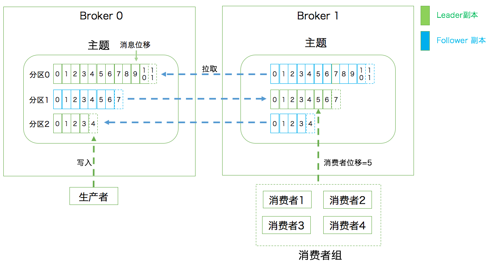

# Kafka权威指南


## Chapter01 初识Kafka

发布与订阅**消息系统**（从下面第③个过程才算）

① 发送与接收者**直接连接**（单直连）

 

② 多发送者与多接受者直接连接（多直连）


③ 单**发布与订阅系统**（接收信息，并为其他系统提供查询服务）


④ 多发布与订阅系统（按任务解耦，维护多套消息系统，发布不同类型数据）


⑤ Kafka（<span style="color:red">消除消息读写操作之间的耦合性</span>，发布通用类型数据）：分布式提交日志 / 分布式流平台

- 消息与批次：**消息** --- 类比数据库表中的一个『数据行』或一条记录；**批次** --- 属于同一个**主题**（topic）和**分区**（partition）的一组消息
  - 实际使用中，需要在时间延迟和吞吐量间权衡：批次消息多，可减少网络开销，但单个消息的计算处理时间会变长
- 模式：消息的展现形式（如JSON、XML）称为『**消息模式**（schema）』
- 主题与分区：**主题** --- 类比数据库表，**消息**通过主题进行分类；**分区** --- 用于实现数据冗余和伸缩性的方法，分区可以分布在不同的服务器上（一个主题可以横跨多个服务器，以此来提供比单个服务器更强大的新能）


# Kafka核心技术与实战

## 一、开篇词 & 课程大纲

- 截止到 2019 年，当下互联网行业最火的技术当属 ABC 了：即所谓的 AI 人工智能、BigData 大数据和 Cloud 云计算云平台。
  - B 要显得平民得多，几乎所有公司都能参与进来。
- 数据密集型业务
  - 对于数据密集型应用来说，如何应对<span style="color:red">**数据量激增、数据复杂度增加以及数据变化速率变快**</span>，是彰显大数据工程师、架构师功力的最有效表征。
  - 就拿数据量激增来说，Kafka 能够有效隔离上下游业务，将上游突增的流量缓存起来，以平滑的方式传导到下游子系统中，避免了流量的不规则冲击（<span style="color:red">**消峰**</span>）
- 学习原因
  - 业务应用广泛：如上一条所说（消息引擎；实时流处理平台）
  - 名气：Apache Kafka 被认为是整个消息引擎领域的执牛耳者
  - 技术：仅需要学习一套框架就能在实际业务系统中实现<span style="color:Red">消息引擎应用、应用程序集成、分布式存储构建，甚至是流处理应用的开发与部署</span>
  - 市场：援引美国 2019 年 Dice 技术薪资报告中的数据，在 10 大薪资最高的技术技能中，掌握 Kafka 以平均每年 12.8 万美元排名第二！排名第一位的是 13.2 万美元 / 年的 Go 语言。
- 学习路径
  - Step01：根据掌握的编程语言去寻找对应的 Kafka 客户端（当前 Kafka 最重要的两大客户端是 Java 客户端和 libkafka 客户端），官网学习代码示例，正确编译、运行样例
  - Step02：修改样例代码尝试去理解并使用其他的 API；编写一个小型项目来验证下学习成果、改善和提升客户端的可靠性和性能；熟读一遍 Kafka 官网文档，确保你理解了那些可能影响可靠性和性能的参数。
  - Step03：学习 Kafka 的高级功能，比如流处理应用开发。流处理 API 不仅能够生产和消费消息，还能执行高级的流式处理操作，比如时间窗口聚合、流处理连接等。
  - 系统管理员 / 运维工程师：学习搭建及管理 Kafka 线上环境、对生产环境的监控（Kafka 提供了超多的 JMX 监控指标，可以选择任意熟知的框架进行监控）；观测真实业务负载下的 Kafka 集群表现，利用已有的监控指标来找出系统瓶颈，然后提升整个系统的吞吐量


课程大纲


- 第一部分：**消息引擎**这类系统大致的原理和用途，以及作为优秀消息引擎代表的 Kafka 在这方面的表现。
- 第二部分：重点探讨 Kafka 如何用于**生产环境**，特别是线上环境方案的制定。
- 第三部分：学习 **Kafka 客户端**的方方面面，既有生产者的实操讲解也有消费者的原理剖析，你一定不要错过。
- 第四部分：着重介绍 Kafka 最核心的**设计原理**，包括 Controller 的设计机制、请求处理全流程解析等。
- 第五部分：涵盖 Kafka **运维与监控**的内容，想获得高效运维 Kafka 集群以及有效监控 Kafka 的实战经验？我必当倾囊相助！
- 最后一个部分： Kafka 流处理组件 Kafka Streams 的实战应用，希望能让你认识一个不太一样的 Kafka。


其他

- 可以关注下Apache Pulsar


## 二、Kafka入门


### 01 消息引擎系统ABC

- 一句话概括：**Apache Kafka 是一款开源的<span style="color:red">消息引擎系统</span>**。
  - Kafka 这一类的系统国外有专属的名字叫 **Messaging System**
  - 译成『消息系统』并不是很恰当，因为它片面强调了消息主体的作用，而忽视了这类系统引以为豪的**消息传递属性**，就像引擎一样，具备某种能量**转换传输的能力**
- 消息引擎系统定义：<span style="color:red">**是一组规范**</span>。企业利用这组规范在不同系统之间传递语义准确的消息，实现松耦合的异步式数据传递。
  - 系统 A 发送消息给消息引擎系统，系统 B 从消息引擎系统中读取 A 发送的消息。
  - 要点1：消息引擎传输的**对象是消息**；
  - 要的2：**如何传输**消息属于消息引擎设计机制的一部分
- 面临的问题：
  - 既然消息引擎是用于在不同系统之间传输消息的，那么如何设计待**传输消息的格式**。一条消息如何做到信息表达业务语义而无歧义，同时它还要能最大限度地提供**可重用性以及通用性**
    - 成熟解决方案：CSV、XML、JSON；Google 的 Protocol Buffer 或 Facebook 的 Thrift。
    - Kafka方案：**纯二进制的字节序列**。当然消息还是结构化的，只是在使用之前都要将其转换成二进制的字节序列。
  - 具体的**传输协议**，即我用什么方法把消息传输出去。Kafka支持如下两种常用的消息引擎模型
    - **点对点模型**：也叫**消息队列模型**。系统 A 发送的消息只能被系统 B 接收，其他任何系统都不能读取 A 发送的消息。日常生活的例子比如电话客服就属于这种模型
    - **发布 / 订阅模型**：有一个主题（Topic）的概念，你可以理解成逻辑语义相近的消息容器。该模型也有发送方和接收方，只不过提法不同。发送方也称为发布者（Publisher），接收方称为订阅者（Subscriber）。和点对点模型不同的是，这个模型可能存在多个发布者向相同的主题发送消息，而订阅者也可能存在多个，它们都能接收到相同主题的消息。生活中的报纸订阅就是一种典型的发布 / 订阅模型。
    - JMS（Java Message Service）：支持点对点 / 发布-订阅模型。严格来说它并非传输协议而仅仅是一组 API 罢了。不过可能是 JMS 太有名气以至于很多主流消息引擎系统都支持 JMS 规范，比如 ActiveMQ、RabbitMQ、IBM 的 WebSphere MQ 和 Apache Kafka。**当然 Kafka 并未完全遵照 JMS 规范**
- 使用消息引擎的必要性（而不是直接系统A发往系统B）：
  - <span style="color:red">**削峰填谷**</span>：所谓的“削峰填谷”就是指缓冲上下游瞬时突发流量，使其更平滑。特别是对于那种发送能力很强的上游系统，如果没有消息引擎的保护，“脆弱”的下游系统可能会直接被压垮导致全链路服务“**雪崩**”。消息引擎，它能对抗上游的**流量冲击**，做到将上游的“峰”填满到“谷”中，避免了**流量的震荡**。
  - 发送方和接收方的**松耦合**：在一定程度上简化了应用的开发，减少了系统间不必要的交互。


其他

- kafka，怎么解决实时结果响应问题呢？比如秒杀商品，生产者产生订单，消费者处理订单结果，那这结果如何实时返回给用户呢？
  - 这个场景使用Kafka Streams比较适合，它就是为read-process-write场景服务的
- 和其他消息中间件区别：什么时候选择RabbitMQ什么时候选择Kafka；感觉kafka和rocketmq的设计有很多相似之处，能否列举一下他们之间的区别呢？如果要选型，哪些场景适合用kafka，哪些场景适合用rocketmq呢
  - RabbitMQ属于比较传统的消息队列系统，支持标准的消息队列协议（AMQP, STOMP，MQTT等），如果你的应用程序需要支持这些协议，那么还是使用RabbitMQ。另外RabbitMQ支持比较复杂的consumer Routing，这点也是Kafka不提供的。
  - 就目前公开的资料查看，RocketMQ宣称擅长主打金融业务领域场景，我个人是比较相信的。Kafka更多还是发家于大数据领域。（作者和RocketMQ的冯总相识，不好妄加评论）
  - 如果是以实现高吞吐量为主要目标，Kafka是不错的首选；如果是以实现业务系统为主要目标，特别是金融类业务，可以考虑应用Kafka的流处理组件Kafka Streams。不过坦率说目前将Kafka应用于纯业务系统的并不多，但是前景依然可期
- 怎么读源码：建议可以先从kafka.log包开始读起，会很有收获
- mq和rpc调用的区别
  - 区别往大了说属于**数据流模式**（dataflow mode）的问题。我们常见的数据流有三种：
    - 通过数据库；
    - 通过服务调用（REST/RPC）; 
    - 通过异步消息传递（消息引擎，如Kafka）
  - 相似之处的，毕竟我们远程调用一个服务也可以看做是一个事件，但也有不同：
    -  MQ有自己的buffer，能够对抗过载（overloaded）和不可用场景
    -  MQ支持重试
    - 允许发布/订阅模式
  - 当然它们还有其他区别。应该这样说RPC是介于通过数据库和通过MQ之间的**数据流模式**。
- 现在使用aws kinesis 服务，怎么才能说服领导引进kafka 呢
  - 使用Kafka自己把控度会高一些。另外很多公司对数据出公网是有顾虑的，使用云上的服务必然涉及到将 公司数据传给云服务器的问题。如果是敏感数据这也是要考虑的
- 数据不一致，丢消息问题
  - Kafka对消息持久性是有一定程度的保障的，当然这种**保障是有限度**的。其实，任何分布式系统在数据持久性方面的保障都是有条件的。但是你还是可以安全地认为：配置良好的Kafka是不会丢失消息的
- Kafka官网的描述是“Apache Kafka® is a distributed streaming platform.”，我觉得这里的重点在于分布式和流式处理，而且我认为消息引擎也可以看做是流式处理的一种，不知道老师怎么看？
  -  Kafka是以**消息引擎**起家的，后面转型成**流处理平台**。我不认为消息引擎是流处理的一种。事实上，流处理在意的是如何处理无限数据集的问题。它们是不同的领域
- http之类协议，与消息传输协议（点对点、发布-订阅模式）
  - http不属于**消息传输协议**，它是**网络通信协议**的一种，严格来说这是两个范畴或者说是两个层次上的协议。
  - 通常来说，两个进程进行数据流交互的方式一般有三种：
    - 通过数据库：进程1写入数据库；进程2读取数据库
    - 通过服务调用：比如REST或RPC，而HTTP协议通常就作为REST方式的底层通讯协议
    - 通过消息传递的方式：进程1发送消息给名为broker的中间件，然后进程2从该broker中读取消息。消息传输协议属于这种模式
  - 因此我说虽然我们都称它们为协议，但它们不是一个层次上的协议。
- kafka突然宕机或者临时停止服务进行更新，上游服务的消息该怎么正确更好处理呢？怎么保证消息的能够在kafka恢复工作的时候正确传递
  - 如果是升级Kafka这种主动停机，应该采用rolling upgrade来做，不至于服务中断。如果是大面积突然宕机，快速处理反而是最重要的。如果在乎上游系统的消息delivery语义，增加retries的同时试试幂等producer吧


### 02 Kafka术语

#### 消息-数据流

- **消息（Record）**：Kafka 是消息引擎，这里的消息就是指 Kafka 处理的主要对象。

- **主题（Topic）**：主题是承载消息的逻辑容器，在实际使用中多用来区分具体的业务。
  - 发布订阅的对象是主题（Topic），你可以为每个业务、每个应用甚至是每类数据都创建专属的主题。

- **生产者（Producer）**：向主题发布消息的客户端应用程序称为生产者（Producer），生产者程序通常持续不断地向一个或多个主题发送消息
- **消费者（Consumer）**：订阅这些主题消息的客户端应用程序就被称为消费者（Consumer）。
  - 和生产者类似，消费者也能够同时订阅多个主题的消息。我们把生产者和消费者统称为**客户端（Clients）**


#### 消息-服务端

> 高可用性：保证数据的持久化或消息不丢失
>
> 伸缩性（Scalability）：分布式系统中非常重要且必须要谨慎对待的问题。使服务不受限于单台机器的性能

- **Kafka服务端**：Kafka 的服务器端由被称为 **Broker** 的服务进程构成，即一个 Kafka 集群由多个 Broker 组成
  - 作用：Broker 负责接收和处理客户端发送过来的请求，以及对消息进行**持久化**。
  - 高可用性：多个 Broker 进程能够运行在同一台机器上，但<span style="color:red">更常见的做法是将不同的 Broker 分散运行在不同的机器上</span>（做消息冗余）
- **备份机制（Replication）**：实现高可用的另一个手段
  - **副本（Replica）**：把相同的数据拷贝到**多台机器**上，而这些相同的数据拷贝在 Kafka 中被称为副本（Replica），副本的数量是可以配置的。
  - 副本角色：Kafka 定义了两类副本：
    - **领导者副本（Leader Replica）**：对外提供服务（与**客户端**程序进行交互）；<span style="color:red">生产者总是向领导者副本写消息；而消费者总是从领导者副本读消息</span>（客户端会首先请求topic分区的leader副本在哪个broker上，内部自动执行）
    - **追随者副本（Follower Replica）**：不能与外界进行交互（在很多其他系统中追随者副本是可以对外提供服务的，比如 MySQL 的从库是可以处理读操作的，但是在 Kafka 中追随者副本不会对外提供服务）；追随者副本，它只做一件事：<span style="color:red">向领导者副本发送请求，请求领导者把最新生产的消息发给它</span>，这样它能保持与领导者的同步。
- **分区机制（Partitioning）**：解决伸缩性（Scalability）的问题
  - 具体问题：倘若领导者副本积累了太多的数据以至于单台 Broker 机器都无法容纳了，此时应该怎么办呢？
  - 思路：把数据分割成多份保存在不同的 Broker 上
  - 具体实现：
    - Kafka 中的分区机制指的是将每个主题划分成多个**分区（Partition）**，每个分区是一组**有序**的消息日志。
    - 生产者生产的每条消息**只会被发送到一个分区中**，也就是说如果向一个双分区的主题发送一条消息，这条消息要么在分区 0 中，要么在分区 1 中（<span style="color:red">Kafka 的分区编号是从 0 开始</span>）。
    - <span style="color:red">**每个分区下**可以配置若干个副本，其中**只能有 1 个领导者副本**和 N-1 个追随者副本</span>。
    - 生产者向分区写入消息，每条消息在分区中的位置信息由一个叫**分区位移（Offset）**的数据来表征（从0开始）。


#### 消息-三层消息架构



基于高可用性，**Broker**、**副本（Replica）**常与某台机器绑定；而**主题（Topic）**、**分区（Partition）**是跨机器的概念

- 第一层是**主题层（topic）**：每个主题可以配置 M 个分区（存不同数据），而每个分区又可以配置 N 个副本。
- 第二层是**分区层（Partition）**：每个分区的 N 个副本（存相同数据）中只能有一个充当领导者角色，对外提供服务；其他 N-1 个副本是追随者副本，只是提供数据冗余之用。
- 第三层是**消息层**：分区中包含若干条消息，每条消息的位移（Offset）从 0 开始，依次递增。
- 最后，客户端程序只能与分区的领导者副本进行交互。


#### 数据持久化 & 消费者

- 持久化整体思路：Kafka 使用**消息日志（Log）**来保存数据，一个日志就是磁盘上一个只能追加写（Append-only）消息的**物理文件**。
  - 写数据：因为只能追加写入，故避免了缓慢的随机 I/O 操作，改为性能较好的**顺序 I/O 写操作**，这也是实现 Kafka 高吞吐量特性的一个重要手段。（不过如果不停地向一个日志写入消息，最终会耗尽所有磁盘空间，因此 Kafka 必然要定期地删除消息以回收磁盘）
  - 清理数据：**日志段（Log Segment）**机制
    - 写：Kafka 底层，一个日志又近一步细分成多个日志段，消息被追加写到当前最新的日志段中，当写满了一个日志段后，Kafka 会自动切分出一个新的日志段，并将老的日志段封存起来
    - 清：Kafka 在后台还有定时任务会定期地检查老的日志段是否能够被删除，从而实现回收磁盘空间的目的。
- 消费者：点对点（P2P）传输模型为例
  - Kafka 中实现这种 P2P 模型的方法就是引入了**消费者组（Consumer Group）**：多个消费者实例共同组成一个组来消费一组主题。（这组主题中的<span style="color:red">每个分区都只会被组内的一个消费者实例消费，其他消费者实例不能消费它</span>）
    - **消费者实例（Consumer Instance）**：可以是运行消费者应用的进程，也可以是一个线程，它们都称为一个消费者实例。
  - 消费者组意义：提升消费者端的吞吐量。多个消费者实例同时消费，加速整个消费端的吞吐量（TPS）
  - **“重平衡”（Rebalance）**：假设组内某个实例挂掉了，Kafka 能够自动检测到，然后把这个 Failed 实例之前负责的分区转移给其他活着的消费者（消费者实例自动重新分配订阅主题分区的过程）。（既是大名鼎鼎，也是臭名昭著，因为由重平衡引发的消费者问题比比皆是。事实上，目前很多重平衡的 Bug 社区都无力解决。）
  - **消费者位移（Consumer Offset）**：每个消费者在消费消息的过程中必然需要有个字段记录它当前<span style="color:red">消费到了分区的哪个位置上</span>，这个字段就是消费者位移。
  - <span style="color:red">每个分区只能被一个消费者实例消费，一个消费者实例可以消费多个分区。当消费者组只有一个实例时，将无法分配到任何分区，处于idle状态。</span>


#### 总结

高可用性：分散Broker、副本机制、重平衡

伸缩性：分区机制


#### 其他

1、为什么不和MySQL一样（主从都能读取），从follower读取？https://www.zhihu.com/question/327925275/answer/705690755

- 和MySQL区别：kafka的**分区**已经让读是从多个broker读从而负载均衡，不是MySQL的主从，压力都在主上；
  - 『主写从读』有数据不一致的问题（消息同步需要时间）。『主写从读』是为了减轻leader节点压力，但如果kafka的分区相对均匀分散，同样可以达到负载均衡效果，没必要加大代码复杂度
- （×）消息区别：kafka是消费队列，保存的是流数据，消费数据需要位移（MySQL是实体数据，不存在此概念），如果允许从follower读取，会使消费端位移（consumer offset）的控制更为复杂  ---- 维护成本不高。Kafka中消费进度由clients端来操作，即消费者来决定什么时候提交位移，而且是提交到专属的topic上，与副本本身关联不大


2、kafka是按照什么规则将消息划分到各个分区的？

- 如果producer**指定**了要发送的目标分区，消息自然是去到那个分区；
- 否则就按照producer端参数partitioner.class指定的**分区策略**来定；
- 如果你没有指定过partitioner.class，那么默认的规则是：看消息是否有key，如果有则计算key的**murmur2哈希值%topic分区数**；
- 如果没有key，按照**轮询**的方式确定分区。


3、既然同一个topic下的消息分布在不同的分区，那是什么机制将topic、partition、record关联或者说管理起来的？

- 这个层级其实是逻辑概念。在物理上还是以日志段（log segment）文件的方式保存，日志段文件在内存中有对应的Java对象，里面关联了你说的这些。


4、服务端Consumer的TotalTimeMs的值有时候好几万,有遇到过吗？这种情况引发的原因是什么呀？

- 好几万大概对应于几十秒，TotalTimeMs是指请求从接收到处理完成后发送响应的间隔。这中间包含很多环节，你最好确认下时间都花在哪里了？
  比如请求入队列的时间、本地读磁盘时间、等待远程API调用的时间（由于你是consumer，这个应该没有）、响应入队列时间、以及response发送时间。


5、如果我关心的不是一个window的状态而只是想排序，kafka streams可以直接实现么？

- 很难。如果在乎消息顺序，通常的做法是单分区。
- 在流处理中保持事件的全局顺序几乎不可能，我指的是基于event-time而不是process-time的，毕竟总有late message。你永远不知道时刻T之前的消息是否全部到达了


### 03 从消息引擎系统到分布式流处理平台

- 系统学习：虽然快速地搞定了某个技术细节，但无法建立全局的认知观，这会导致你只是在单个的点上有所进展，却没法将其串联成一条线进而扩展成一个面，从而实现系统地学习。

  - 从点开始：在一个点一个点地学习，但全部学完之后压根没有任何感觉，依然不了解 Kafka，因为不知道这些包中的代码组合在一起能达成什么效果。所以我说它是很低效的学习方法。
  - 自上而下的角度去理解 Kafka：这种学习方法能够帮助我维持较长时间的学习兴趣，不会阶段性地产生厌烦情绪。特别是在了解 Apache Kafka 整个发展历史的过程中我愉快地学到了很多运营大型开源软件社区的知识和经验，可谓是技术之外的一大收获。

- 一句话总结：<span style="color:red">**Apache Kafka 是消息引擎系统，也是一个分布式流处理平台（Distributed Streaming Platform）**</span>。

- 发展历史：【推荐一个Confluence的演讲，题目是ETL is dead，其中讲到了Kafka在流处理平台的来龙去脉】

  - Kafka 是 LinkedIn 公司内部孵化的项目，最开始有强烈的**数据强实时处理**方面的需求，其内部的诸多子系统要执行多种类型的数据处理与分析，主要包括业务系统和应用程序性能监控，以及用户行为数据处理等。

    

    - 数据正确性不足。因为数据的收集主要采用轮询（Polling）的方式，如何确定轮询的间隔时间就变成了一个高度经验化的事情。虽然可以采用一些类似于启发式算法（Heuristic）来帮助评估间隔时间值，但一旦指定不当，必然会造成较大的数据偏差。
    - 系统高度定制化，维护成本高。各个业务子系统都需要对接数据收集模块，引入了大量的定制开销和人工成本。

  - 为了解决这些问题，LinkedIn 工程师尝试过使用 ActiveMQ 来解决这些问题，但效果并不理想。显然需要有一个“大一统”的系统来取代现有的工作方式，而这个系统就是 Kafka。

  - Kafka 自诞生伊始是以**消息引擎系统**的面目出现在大众视野中的。0.10.0.0 之前的官网说明， Kafka 社区将其清晰地定位为一个分布式、分区化且带备份功能的提交日志（Commit Log）服务。

    - Kafka 作者之一 Jay Kreps 曾经谈及过命名的原因：Kafka 系统的写性能很强，所以找了个作家的名字来命名似乎是一个好主意。
    - 特点1：提供一套 API 实现生产者和消费者；
    - 特点2：降低网络传输和磁盘存储开销；
    - 特点3：实现高伸缩性架构。

  - 随着 Kafka 的不断完善，Jay 等大神们终于意识到将其**开源**惠及更多的人是一个非常棒的主意，因此在 2011 年 Kafka 正式进入到 Apache 基金会孵化并于次年 10 月顺利毕业成为 Apache 顶级项目

  - 流处理：

    - 所有的数据几乎都要从一个系统流入 Kafka 然后再流向下游的另一个系统中。
    - 这样的使用方式屡见不鲜以至于引发了 Kafka 社区的思考：与其我把数据从一个系统传递到下一个系统中做处理，我为何不自己实现一套流处理框架呢？
    - 基于这个考量，Kafka 社区于 0.10.0.0 版本正式推出了流处理组件 Kafka Streams，也正是从这个版本开始，Kafka 正式“变身”为分布式的流处理平台，而不仅仅是消息引擎系统了。

  - <span style="color:red">今天 Apache Kafka 是和 Apache Storm、Apache Spark 和 Apache Flink 同等级的实时流处理平台</span>。

- 作为流处理平台，Kafka 与其他主流大数据流式计算框架相比，优势在哪里呢？

  - ①  **更容易实现端到端的正确性（Correctness）**：要实现正确性和提供能够推导时间的工具。实现正确性是流处理能够匹敌批处理的基石。
    - 正确性一直是批处理的强项，而实现正确性的基石则是要求框架能提供**精确一次处理语义**，即处理一条消息有且只有一次机会能够影响系统状态。（eg：如果我们使用Kafka计算某网页的PV——我们将每次网页访问都作为一个消息发送的Kafka。PV的计算就是我们统计Kafka总共接收了多少条这样的消息即可。精确一次处理语义表示每次网页访问都会产生且只会产生一条消息，否则有可能产生多条消息或压根不产生消息。）
    - 目前主流的大数据流处理框架都宣称实现了精确一次处理语义，但这是有限定条件的，即它们只能实现框架内的精确一次处理语义，无法实现**端到端**的。（所有的数据流转和计算都在 Kafka 内部完成，故 Kafka 可以实现端到端的精确一次处理语义）
    - Kafka在0.11版本实现了exactly once，保证一条消息只会被消费一次（Apache Flink从1.4开始推出了支持E2E Exactly-Once语义的两阶段SinkFunction。它用的就是Kafka 0.11的事务）
  - ②  Kafka**对于流式计算的定位**：官网上明确标识 Kafka Streams 是一个用于搭建实时流处理的**客户端库**（library）而非是一个完整的功能系统（platform）。（没有类似于集群调度、弹性部署等开箱即用的运维特性 ----- 对中小公司，数据量不大、逻辑不复杂，搭建重量级完整平台不划算）

- 其他用途：Kafka 能够被用作分布式存储系统（https://www.confluent.io/blog/okay-store-data-apache-kafka/），但这样用的少。


其他

- 目前kafka相关组件太分散以及通过命令行运维，希望有一个平台产品集成所有组件（基础运维，ksql，AI等）
  - Confluent公司的Confluent Kafka做到了这一点。社区版的Kafka没有这样的功能


### 04 选择哪种Kafka "发行版本"

- **Kafka Connect** ：通过一个个具体的连接器（Connector），串联起上下游的外部系统。


#### 4.1 分类

Kafka类型：多个组织或公司发布的不同的 Kafka（类似Linux的发行版本 --- CentOS、RedHat、Ubuntu等）
- **Apache Kafka**：其他所有发行版的基础
- **Confluent Kafka**：主要从事商业化 Kafka 工具开发
  - 2014 年，Kafka 的 3 个创始人 Jay Kreps、Naha Narkhede 和饶军离开 LinkedIn 创办了 Confluent 公司，专注于提供基于 Kafka 的企业级流处理解决方案。
  - 2019 年 1 月，Confluent 公司成功融资 D 轮 1.25 亿美元，估值也到了 25 亿美元
  - Confluent Kafka 提供了一些 Apache Kafka 没有的高级特性，比如跨数据中心备份、Schema 注册中心以及集群监控工具等
- **Cloudera/Hortonworks Kafka**：
  - Cloudera 提供的 **CDH** 和 Hortonworks 提供的 **HDP** ，集成了目前主流的大数据框架，能够帮助用户实现从分布式存储、集群调度、流处理到机器学习、实时数据库等全方位的数据处理。（CDH、HDP 里面都集成了 Apache Kafka，因此我把这两款产品中的 Kafka 称为 CDH Kafka 和 HDP Kafka）
  - 2018 年 10 月两家公司宣布合并，共同打造世界领先的数据平台


#### 4.2 优劣对比

优劣比较（如下版本，集成度越来越高）
- **Apache Kafka**：仅仅需要一个消息引擎系统亦或是简单的流处理应用场景，同时需要对系统有较大把控度，那么我推荐你使用 Apache Kafka。
  - 优点：开发人数最多、版本迭代速度最快的 Kafka。使用 Apache Kafka 碰到任何问题并提交问题到社区，社区都会比较及时地响应你。这对于我们 Kafka 普通使用者来说无疑是非常友好的。
  - 缺点：
    - 仅仅提供最最基础的组件；
    - Kafka Connect 而言，社区版 Kafka 只提供一种连接器，即**读写磁盘文件**的连接器，而没有与其他外部系统交互的连接器，在实际使用过程中需要自行编写代码实现
    - 没有提供任何监控框架或工具（有一些开源的监控框架，如 Kafka manager 可以帮助用于监控）
- **Confluent Kafka**：（Kafka 原班人马打造）需要用到 Kafka 的一些高级特性，那么推荐
  - 【分类】分为免费版和企业版两种
  - 免费版：除Apache kafka基础组件外，还包含 Schema 注册中心（集中管理 Kafka 消息格式以实现数据前向 / 后向兼容）和 REST proxy （用开放 HTTP 接口的方式允许你通过网络访问 Kafka 的各种功能）两大功能；以及更多的连接器
  - 企业版：最有用的当属跨数据中心备份（**数据同步**）和集群**监控**两大功能了
  - 缺点：无国内业务，文档不齐全，普及率低
- **Cloudera/Hortonworks Kafka**：需要快速地搭建消息引擎系统，或者要搭建的是多框架构成的数据平台且 Kafka 只是其中一个组件，那么推荐使用这些大数据云公司提供的 Kafka。
  - 优点：Kafka 的安装、运维、管理、监控 平台界面化，操作友好
  - 缺点：降低了对 Kafka 集群的掌控程度；kafka 版本的滞后性（bug 修复等问题无法及时更进）


#### 4.3 其他

- 监控：监控工具是kafka manager，后面也尝试过 kafka eagle，但是总是感觉这两款工具做的不尽如人意

  - 推荐：JMXTrans + InfluxDB + Grafana

- 现状：Confluent很少，创业公司多是CDH（或阿里云、腾讯云），大厂一般使用Apache Kafka，并且自己做了定制和改造

  

### 05 Kafka版本号

> 后面出现的所有“版本”这个词均表示 **Kafka 具体的版本号**，而非上一篇中的 Kafka 种类，这一点切记切记！

重要性：如果不了解各个版本之间的差异和功能变化，就不能够准确地评判某 Kafka 版本是不是满足你的业务需求


#### 5.1 Kafka版本命名


- 【kafka_2.11-2.2.1】前面的版本（2.11）：编译 Kafka 源代码的 **Scala 编译器版本**
  - Kafka 服务器端的代码完全由 Scala 语言编写，Scala 同时支持面向对象编程和函数式编程
  - 用 Scala 写成的源代码编译之后也是普通的“.class”文件，因此我们说 Scala 是 JVM 系的语言
  - 目前 Java 新推出的很多功能都是在不断向 Scala 语言靠近罢了，比如 Lambda 表达式、函数式接口、val 变量等。
  - 一个有意思的事情是，Kafka 新版客户端代码完全由 Java 语言编写（仅仅是因为社区来了一批 Java 程序员而已，而以前老的 Scala 程序员隐退罢了）。题外话 --- **建议学习下Scala语言**
- 【kafka_2.11-2.2.1】后面的版本（2.21）：kafka真正的版本
  - 前面的2：大版本号（Major Version）；早期的命名是4位版本号，可以把 0.11当一个大版本号看待
  - 中间的2：小版本号（Minor Version）或次版本号
  - 最后的1：修订版本号（Patch）


#### 5.2 版本号演进

Kafka 目前总共演进了 **7 个大版本**，分别是 0.7、0.8、0.9、0.10、0.11、1.0 和 2.0

```
小版本和 Patch 版本很多。哪些版本引入了哪些重大的功能改进？
关于这个问题，我建议你最好能做到如数家珍，因为这样不仅令你在和别人交谈 Kafka 时显得很酷，而且如果你要向架构师转型或者已然是架构师，那么这些都是能够帮助你进行技术选型、架构评估的重要依据。
```


> <span style="color:red">不论你用的是哪个版本，都请尽量**保持服务器端版本和客户端版本一致**，否则你将损失很多 Kafka 为你提供的性能优化收益。</span>


##### 5.2.1 从0.7到0.8 - 副本机制

0.7版本只提供了最基础的**消息队列**功能，甚至连副本机制都没有，没理由使用

0.8 之后正式引入了**副本机制**，至此 Kafka 成为了一个真正意义上完备的分布式高可靠消息队列解决方案。

- 能够比较好地做到消息无丢失
- 那时候生产和消费消息使用的还是老版本的客户端 API，所谓的老版本是指当你用它们的 API 开发生产者和消费者应用时，你需要指定 ZooKeeper 的地址而非 Broker 的地址。
- 老版本客户端，特别是生产者API存在很多问题：默认使用同步方式发送消息，可以想见其吞吐量一定不会太高。（虽然也支持异步，但实际场景中容易丢消息）
- <span style="color:red">0.8.2.0 版本社区引入了**新版本 Producer API**，即需要指定 Broker 地址的 Producer。</span>（但bug多）
- 【建议】**至少要升级到 0.8.2.2 这个版本，因为该版本中老版本消费者 API 是比较稳定的。另外即使你升到了 0.8.2.2，也不要使用新版本 Producer API，此时它的 Bug 还非常多。**（<span style="color:red">0.8.2.2版本kafka，但使用指定ZooKeeper的老版本客户端API</span>）


##### 5.2.2 重量级0.9版本

0.9 大版本（2015年11月）增加了**基础的安全认证** / **权限功能**，同时使用 Java 重写了**新版本消费者 API**，另外还引入了 **Kafka Connect 组件**用于实现高性能的数据抽取。

- 好处：新版本 **Producer API （指定Broker地址）在这个版本中算比较稳定了**；
- 【建议】<span style="color:red">但不要使用新版本 Consumer API</span>，因为 Bug 超多的，绝对用到你崩溃。即使你反馈问题到社区，社区也不会管的，它会无脑地推荐你升级到新版本再试试


##### 5.2.3 里程碑式大版本0.10 - 流处理平台

因为该版本**引入了 Kafka Streams**。从这个版本起，Kafka 正式升级成分布式流处理平台（虽然还基本不能线上部署使用）

- 两个小版本：0.10.1 和 0.10.2，它们的主要功能变更都是在 Kafka Streams 组件上。

- 如果你把 Kafka 用作消息引擎，实际上该版本并没有太多的功能提升。
- 不过在我的印象中自 **0.10.2.2** 版本起，新版本 **Consumer API** 算是比较稳定了。
- 【建议】**如果你依然在使用 0.10 大版本，我强烈建议你至少升级到 0.10.2.2 然后使用新版本 Consumer API。还有个事情不得不提，0.10.2.2 修复了一个可能导致 Producer 性能降低的 Bug。基于性能的缘故你也应该升级到 0.10.2.2。**


##### 5.2.4 幂等性与消息格式重构0.11版本

0.11.0.0 版本（2017年6月），引入了两个重量级的功能变更：

- 一个是提供**幂等性** Producer API 以及**事务**（Transaction） API；
  - 事务 API 有一些 Bug，不算十分稳定。
  - 另外事务 API 主要是为 Kafka Streams 应用服务的，实际使用场景中用户利用事务 API 自行编写程序的成功案例并不多见。
- 另一个是对 Kafka 消息格式做了重构。
  - 对用户透明（无感知），因为格式变更引起消息格式转换而导致的性能问题在生产环境中屡见不鲜，所以你一定要谨慎对待 0.11 版本的这个变化
- 【结论】各个大功能组件都变得非常稳定了，国内该版本的用户也很多，应该算是目前最主流的版本之一。这个版本的消息引擎功能已经非常完善了。


##### 5.2.5 Streams处理 - 1.0 & 2.0

1.0 和 2.0 版本：这两个大版本主要还是 Kafka Streams 的各种改进，在消息引擎方面并未引入太多的重大功能特性。

- Kafka Streams 的确在这两个版本有着非常大的变化，也必须承认 Kafka Streams 目前依然还在积极地发展着。
- 如果你是 Kafka Streams 的用户，至少选择 2.0.0 版本吧。
- 【注意】两个版本间变化很大（基于Kafka Streams 1.0 版本撰写的Kafka Streams in Action-《Kafka Streams 实战》用2.0版本运行例子无法编译）；不过如果你在意的依然是消息引擎，那么这两个大版本都是适合于生产环境的。


#### 总结

- 尽量保持服务器端版本和客户端版本一致
- 每个 Kafka 版本都有它恰当的使用场景和独特的优缺点，切记不要一味追求最新版本（不要成为最新版本的“小白鼠”）。


提问

1、kafka如何做压力测试，它的参考主要指标是什么，比如QPS,最大连接数，延迟等等。

- Kafka提供了命令行脚本可以执行producer和consumer的性能测试，主要指标还是TPS，延时


2、扩容如何做到平滑扩容，不影响原业务

- 增加broker很简单，也不会对现有业务有影响。关键是做好迁移计划——比如**避开业务高峰**时刻


3、服务端版本靠编号就可以识别，而客户端是怎么定义新旧版本的呢？

- 客户端也有版本号，和broker端是一样的。比如Java客户端，如果我们使用Gradle的话，就类似于这样：

  compile group: 'org.apache.kafka', name: 'kafka-clients', version: '2.2.1'


4、kafka的时间轮里面，第一层的时间轮，默认tick一次是1ms，轮长度为20，一个轮子转下来也就20ms，那为什么ExpiredOperationReaper的时间间隔是200ms啊？

- 这就是一个经验值。目前Kafka延时任务的超时多是以秒级，或至少是压秒级别的。如果按照第一层时间轮的间隔驱动会有一点低效。


##三、Kafka的基础使用

### 06 Kafka线上集群部署方案

既然是集群，那必然就要有多个 Kafka 节点机器，因为只有单台机器构成的 Kafka 伪集群只能用于日常测试之用，根本无法满足实际的线上生产需求。

真正的线上环境需要仔细地考量各种因素，结合自身的业务需求而制定。


#### 6.1 操作系统

- 关于跨平台：Kafka 是 JVM 系的大数据框架，Java 又是跨平台的语言，编译之后的源代码就是普通的“.class”文件。但是不同操作系统的差异还是给 Kafka 集群带来了相当大的影响。
- 如果考虑操作系统与 Kafka 的适配性，<span style="color:red">Linux 系统显然要比其他两个特别是 Windows 系统更加适合部署 Kafka</span>。理由如下


##### **I/O 模型的使用**

- 主流的 I/O 模型通常有 5 种类型：① 阻塞式 I/O、② 非阻塞式 I/O、③ I/O 多路复用、④ 信号驱动 I/O 、⑤ 异步 I/O
  - 比如 Java 中 **Socket** 对象的阻塞模式和非阻塞模式就对应于前两种模型；
  - 而 Linux 中的系统调用 **select** 函数就属于 I/O 多路复用模型；
  - 大名鼎鼎的 **epoll** 系统调用则介于第三种和第四种模型之间；
  - 至于第五种模型，其实很少有 Linux 系统支持，反而是 Windows 系统提供了一个叫 IOCP 线程模型属于这一种
- 一般原则：后一种模型会比前一种模型要高级
- I/O 模型与 Kafka 关联：
  - Kafka 客户端底层使用了 Java 的 selector；
  - selector 在 Linux 上的实现机制是 epoll，而在 Windows 平台上的实现机制是 select。
- 【结论】 **将 Kafka 部署在 Linux 上是有优势的，因为能够获得更高效的 I/O 性能**


##### **数据网络传输效率**

Kafka 生产和消费的消息都是通过网络传输的，而消息保存在磁盘。故 Kafka 需要在磁盘和网络间进行大量数据传输。

- Linux 平台实现了**零拷贝（Zero Copy）**机制：当数据在磁盘和网络进行传输时避免昂贵的内核态数据拷贝从而实现快速地数据传输
- Windows 平台上必须要等到 Java 8 的 60 更新版本才能“享受”到这个福利。
- 【结论】**在 Linux 部署 Kafka 能够享受到零拷贝技术所带来的快速数据传输特性。**


#####**社区支持度**

社区目前对 Windows 平台上发现的 Kafka Bug 不做任何承诺。虽然口头上依然保证尽力去解决，但根据我的经验，Windows 上的 Bug 一般是不会修复的。

【结论】**因此，Windows 平台上部署 Kafka 只适合于个人测试或用于功能验证，千万不要应用于生产环境。**


#### 6.2 磁盘选择与规划

> 哪种资源对 Kafka 性能最重要，磁盘无疑是要排名靠前的


1、在对 Kafka 集群进行磁盘规划时经常面对的问题是，我应该选择普通的机械磁盘还是固态硬盘？

- 机械硬盘：成本低、容量大；易损坏；
- 固态硬盘：性能优势大；单价高
- 【选择】**使用普通机械硬盘即可**
  - SSD性能优势无法发挥：Kafka 大量使用磁盘不假，可它使用的方式多是**顺序读写操作**，一定程度上规避了机械磁盘最大的劣势，即随机读写操作慢。
  - 机械硬盘缺陷可规避：易损坏而造成的可靠性差等缺陷，可由 Kafka 在软件层面提供机制来保证

2、是否应该使用磁盘阵列（RAID）

- 优点1：提供**冗余**的磁盘存储空间
  - 但Kafka 自己实现了冗余机制来提供高可靠性
- 优点2：提供**负载均衡**
  - 通过分区的概念，Kafka 也能在软件层面自行实现负载均衡
- 【选择】追求性价比的公司可以不搭建 RAID


3、【磁盘容量】Kafka 集群到底需要多大的存储空间？

- 参考方向：新增消息数、平均消息大小、备份数、是否启用压缩；消息留存时间
- eg：假设业务每天需要向kafka集群发送 1亿 条消息，平均大小 1KB，每条消息保存2份防止丢失，默认保存2周
  - 总空间为： 1亿  \* 1KB \* 2 / 1000 / 1000 = 200GB
  - 考虑消息本身数据和其他类型数据（如索引数据等）：预留 10% 磁盘空间，约 220GB
  - 保存两周：整体容量 220GB \* 14 ≈ 3TB
  - Kafka支持数据压缩：假设压缩比是 0.75 ，则最后需要规划的存储空间为 3TB \* 0.75 = 2.25TB


#### 6.3 带宽

> 对于 Kafka 这种通过网络大量进行数据传输的框架而言，带宽特别容易成为瓶颈。
>
> - 真实案例当中，带宽资源不足导致 Kafka 出现性能问题的比例至少占 60% 以上
>
> - 如果还涉及跨机房传输，那么情况可能就更糟了


带宽主要有两种：1Gbps 的千兆网络和 10Gbps 的万兆网络

- 特别是**千兆网络**应该是一般公司网络的标准配置了。下面就以千兆网络举例
- 核心问题：与其说是带宽资源的规划，其实<span style="color:red">**真正要规划的是所需的 Kafka 服务器的数量**</span>。


实际举例：机房环境**单机带宽**为千兆网络（1Gbps），业务目标SLA是1小时处理1TB的业务数据，需要多少台Kafka服务器

- 前提：每台 Kafka 服务器都安装在专属的机器上（即每台 Kafka 机器上没有混布其他服务，毕竟真实环境中不建议这么做）
- 经验：如上前提下，<span style="color:red">**只能假设Kafka会用到70%的带宽资源**</span>，因为需要为其他应用或进程保留一些资源（实际使用经验，超过 70% 的阈值就有网络丢包的可能性） ----- 单台Kafka服务器最多使用 700Mb 带宽资源（最大带宽资源）
- 预留资源：不能让Kafka服务器常规性使用最大带宽资源，需额外预留 2/3 资源（2/3 相当保守，可结合使用情况酌情修改） ---- 单台服务器使用带宽 700Mb / 3 ≈ 240Mbps
- 目标：1小时1TB数据，即每秒需要处理 1024 \* 1024 \* 8 Mb / 60 / 60 = 2330Mb 数据
- 结论：2330 / 240 ≈ 10台，如果消息需要额外复制两份，则总服务器台数为 30台


#### 其他 & 提问

1、实际生产中的硬盘选择：普通硬盘导致生产者堵塞写入负载偏高，换成SSD就没事了，我们每天消息数大概50亿。


2、文章中讲到磁盘方面可以抛弃RAID,直接使用普通磁盘上去。那么一旦这块磁盘出问题了，数据不就丢失了吗。如果raid的话，还有其他磁盘有相应的冗余数据的

-  Kafka 1.1开始正式支持JBOD了。再说Kafka本身在软件层面也提供了冗余的机制来对抗磁盘损坏。


3、CPU有性能的影响吗

- 通常情况下Kafka不太占用CPU，因此没有这方面的最佳实践出来。但有些情况下Kafka broker是很耗CPU的：1. server和client使用了不同的压缩算法；2. server和client版本不一致造成消息格式转换；3. broker端解压缩校验

  其中前两个都能规避，第三个目前无法规避。不过相比带宽资源，CPU通常都不是瓶颈


4、Kafka分区数量设置需要参考每秒传输的字节数计算吗？

- 通常不必这么细粒度。网上有一些分区制定的建议，我觉得这个粗粒度的方法就很好，值得一试：
  ① 首先你要确定你业务的SLA，比如说你希望你的producer TPS是10万条消息/秒，假设是T1
  ② 在你的真实环境中创建一个单分区的topic测试一下TPS，假设是T2
  ③ 你需要的分区数大致可以等于T1 / T2


5、能讲讲kafka的性能测试脚本怎么使用吗？

- 直接敲命令有参数提示，可以详细看下。另外我的建议是：kafka-producer-perf-test脚本还不错，kafka-consumer-perf-test有点难用


6、zookeeper部署方案和kafka一样么？分开部署还是部署到一起？我们现在都是一个机器上部署一个zookeeper和一个kafka

- 如果配置好ZooKeeper事务日志（比如设置好autopurge.purgeInterval及定期删除snapshot等），它对IO的需求不大，混布也是可以的。


### 07 最最最重要的集群参数配置（上）

> 有些配置的重要性并未体现在官方文档中，并且从实际表现看，**很多参数对系统的影响要比从文档上看更加明显**，因此很有必要集中讨论一下。
>
> 
>
> 严格来说这些配置并不单单指 Kafka 服务器端的配置，其中既有 Broker 端参数，也有 Topic 级别的参数、JVM 端参数和操作系统级别的参数

目前 Kafka Broker 提供了近 200 个参数，这其中绝大部分参数都不用你亲自过问。如下参数都是指那些<span style="color:red">**不能使用默认值的参数**</span>


#### 7.1 Broker 端 - 存储信息类参数

【内容】Broker 使用哪些磁盘的问题


【相关参数】

- **log.dirs**：非常重要的参数，指定了 Broker 需要使用的若干个文件目录路径。这个参数没有默认值，必须亲自指定。
- **log.dir**：表示单个路径，它是补充上一个参数用的。


【配置原则】

- 只要设置 `log.dirs` 就好了，不要设置`log.dir`。
- 更重要的是，在线上生产环境中一定要为 `log.dirs` **配置多个路径**，具体格式是一个 CSV 格式，也就是用逗号分隔的多个路径，比如`/home/kafka1,/home/kafka2,/home/kafka3`这样。
- 如果有条件的话你最好保证这些目录**挂载到不同的物理磁盘上**
  - **提升读写性能**：比起单块磁盘，多块物理磁盘同时读写数据有更高的吞吐量。
  - 能够实现**故障转移**：即 **Failover**。这是 Kafka 1.1 版本新引入的强大功能。要知道在以前，只要 Kafka Broker 使用的任何一块磁盘挂掉了，整个 Broker 进程都会关闭。但是自 1.1 开始，这种情况被修正了，坏掉的磁盘上的数据会自动地转移到其他正常的磁盘上，而且 Broker 还能正常工作。这个改进正是我们舍弃 RAID 方案的基础：没有这种 Failover 的话，我们只能依靠 RAID 来提供保障。


#### 7.2 Broker 端 - ZooKeeper设置

【内容】

- ZooKeeper 是一个**分布式协调框架**
- 负责协调管理并保存 Kafka 集群的所有**元数据信息**（比如集群都有哪些 Broker 在运行、创建了哪些 Topic，每个 Topic 都有多少分区以及这些分区的 Leader 副本都在哪些机器上等信息）


【相关参数】

- **zookeeper.connect**：Kafka集群使用哪个zookeeper配置。也是一个 CSV 格式的参数，比如我可以指定它的值为`zk1:2181,zk2:2181,zk3:2181`。2181 是 ZooKeeper 的默认端口。


【配置方案】

多个 Kafka 集群使用同一套 ZooKeeper 集群：使用chroot（ZooKeeper 的概念，类似于别名）

- 设定：两套 Kafka 集群，分别为 kafka1、kafka2
- 则两套kafka集群的 **zookeeper.connect** 可以分别指定为：zk1:2181,zk2:2181,zk3:2181/kafka1 和zk1:2181,zk2:2181,zk3:2181/kafka2 （chroot即为最后面的标识，即/kafka1和/kafka2，只需要写一次，而且是加到最后的）


#### 7.3 Broker端 - 连接通信

【内容】客户端程序或其他 Broker 如何与该 Broker 进行通信的设置


【相关参数】

- **listeners**：学名叫监听器，其实就是告诉外部连接者要通过什么协议访问指定主机名和端口开放的 Kafka 服务。
- **advertised.listeners**：和 listeners 相比多了个 advertised。Advertised 的含义表示宣称的、公布的，就是说这组监听器是 Broker 用于对外发布的。
- **host.name/port**：过期的参数，无需指定


【配置方案】

- listeners配置：若干个逗号分隔的三元组，每个三元组的格式为 \<协议名称，主机名，端口号\>。
  - 协议名称可能是标准的名字：比如 **PLAINTEXT** 表示明文传输、**SSL** 表示使用 SSL 或 TLS 加密传输等
  - 也可能是你自己定义的协议名字，比如 **CONTROLLER: //localhost:9092** 。（需映射成标准协议，见下）
  - 若为自定义协议名称，则还需配置  **listener.security.protocol.map** 参数告诉这个协议底层使用了哪种安全协议。比如指定**listener.security.protocol.map=CONTROLLER:PLAINTEXT** 表示 CONTROLLER 这个自定义协议底层使用明文不加密传输数据。
- 主机名这个设置中我到底使用 IP 地址还是主机名：**最好全部使用主机名，即 Broker 端和 Client 端应用配置中全部填写主机名**
  -  Broker 源代码中也使用的是主机名，如果你在某些地方使用了 IP 地址进行连接，可能会发生无法连接的问题。


#### 7.4 Broker端 - Topic 管理

- **auto.create.topics.enable**：是否允许自动创建 Topic。
  - 建议设置为false，防止线上出现稀奇古怪名字的Topic
  - 场景：为名为test的topic发事件，拼写错为tst并启动了生产者程序，导致名为tst的topic被自动创建
  - 原则：分配的Topic应该由运维严格把控，决不能允许自行创建任何Topic
- **unclean.leader.election.enable**：是否允许关闭 Unclean Leader 选举。
  - 解释：Kafka有多个副本，只有Leader副本对外提供服务。而只有保存数据多的副本才能竞选Leader，那些落后进度太多的副本（因为是异步拉取的消息）没资格竞争。当那些保存数据比较多的副本都挂了时，还要不要进行 Leader 选举，就是该参数的意义
  - 为false时：坚决不能让那些落后太多的副本竞选 Leader，后果是这个**分区就不可用**了，因为没有 Leader 了。
  - 为true时：允许你从那些“跑得慢”的副本中选一个出来当 Leader。这样做的后果是**数据有可能就丢失**了，因为这些副本保存的数据本来就不全，当了 Leader 之后它本人就变得膨胀了，认为自己的数据才是权威的。
  - 【建议】社区对这个参数的默认值来来回回改了好几版了，鉴于不知道用的是哪个版本的 Kafka，所以建议还是显式地把它**设置成 false** 吧。
- **auto.leader.rebalance.enable**：是否允许定期进行 Leader 选举替换。
  - 解释：为true时，表示允许 Kafka 定期地对一些 Topic 分区进行 Leader 重选举，当然这个重选举不是无脑进行的，它要满足一定的条件才会发生。并且它不是选 Leader，而是换 Leader！比如 Leader A 一直表现得很好，但若为true，那么有可能一段时间后 Leader A 就要被强行卸任换成 Leader B。
  - 成本：换一次 Leader 代价很高的，原本向 A 发送请求的所有客户端都要切换成向 B 发送请求，而且这种换 Leader 本质上没有任何性能收益
  - 【建议】生产环境中**设置为 false**


#### 7.5 Broker端 - 数据留存

- **log.retention.{hour|minutes|ms}**：控制一条消息数据被保存多长时间。从优先级上来说 ms 设置最高、minutes 次之、hour 最低。
  - 虽然 ms 设置有最高的优先级，但是通常情况下我们还是设置 hour 级别的多一些，比如  **log.retention.hour=168** 表示默认保存 7 天的数据，自动删除 7 天前的数据。
  - 很多公司把 Kafka 当做存储来使用，那么这个值就要相应地调大。
- **log.retention.bytes**：这是指定 Broker 为消息保存的总磁盘容量大小（**默认值为 -1** ，即不对容量进行限制）。
  - 场景：多用在云上构建多租户的 Kafka 集群。设想你要做一个云上的 Kafka 服务，每个租户只能使用 100GB 的磁盘空间，为了避免有个“恶意”租户使用过多的磁盘空间，设置这个参数就显得至关重要了。
- **message.max.bytes**：控制 Broker 能够接收的最大消息大小。（默认 1000012字节，不足1MB）
  - 实际场景中突破 1MB 的消息都是屡见不鲜的，因此在线上环境中设置一个比较大的值还是比较保险的做法。毕竟它只是一个标尺而已，仅仅衡量 Broker 能够处理的最大消息大小，即使设置大一点也不会耗费什么磁盘空间的。


#### 总结

1、连接通信中，advertised.listeners 这个配置能否再解释一下。感觉配置了 listeners之后就不用配置这个了呀？

- advertised.listeners主要是为外网访问用的。如果clients在内网环境访问Kafka不需要配置这个参数。
- 常见的玩法是：你的Kafka Broker机器上配置了双网卡，一块网卡用于内网访问（即我们常说的内网IP）；另一个块用于外网访问。那么你可以配置listeners为内网IP，advertised.listeners为外网IP。


2、讲讲这个参数吧auto.offset.reset

- 当consumer启动后它会从Kafka读取它上次消费的位移。
  - 情况1： 如果 Kafka broker端没有保存这个位移值，那么consumer会看auto.offset.reset的脸色
  - 情况2：consumer拿到位移值开始消费，如果后面发现它要读取消息的位移在Kafka中不存在（可能对应的消息已经被删除了），那么它也会看auto.offset.reset的脸色
  - 情况3：除以上这两种情况之外consumer不会再顾忌auto.offset.reset的值
- 怎么看auto.offset.reset的脸色呢？简单说就是earliest从头消息；latest从当前新位移处消费。


3、对于磁盘坏掉以后转移到其他磁盘的机制，我有点疑问，如果已经坏掉，则不可读了，那么是不是只能从副本去转移了，如果从副本转移那就有可能会丢失部分最新的数据吧？

- 不会啊，broker会重建副本，然后走正常的同步机制：从leader处拉取数据。
- Broker会自动在好的目录上重建副本，然后从leader同步。
- 另外Kafka也提供了工具将某块磁盘上的数据直接搬移到另一个磁盘上，毕竟磁盘坏了也不是不能修好


4、这个参数delete.topic.enable，胡老师有什么建议么？

- 建议delete.topic.enable保持默认值true就好，毕竟不能删除topic总显得不太方便。
- 只是要注意权限设置即可，不可能 让任何人都能有删除topic的权限。


5、kafka保存偏移量好像是在zookeeper，不是在kafka

- 这是老版本consumer的设计。目前老版本已经废弃了


6、auto.leader.rebalance.enable 这个值设置为true，那么您说的定期重新选举，应该有个触发的条件吧？跟每台broker的leader数量有关，如果leader分布不均衡就会触发重新选举leader，但是感觉说的还是不够具体，您能给解答下吗

- 的确是有个比例，要超过这个比例才会触发preferred leader选举。这个比例由broker端参数 **leader.imbalance.per.broker.percentage** 控制，默认是10%。举个例子，如果一个broker上有10个分区，有2个分区的leader不是preferred leader，那么就会触发


7、假如现有集群已经有3个分区，动态添加两个分区, 原有的分区会迁移数据到新增的分区吗？

- 不会。已有数据将一直“躺在”原有分区中。


### 08 最最最重要的集群参数配置（下）

> 当前最新的 2.2 版本总共提供了大约 25 个 Topic 级别的参数，当然我们也不必全部了解它们的作用，这里我挑出了一些最关键的参数，你一定要把它们掌握清楚。


#### Topic 级别参数

Q：同时设置了 Topic 级别参数和全局 Broker 参数，谁优先：**Topic 级别参数会覆盖全局 Broker 参数的值**


【消息留存】

- **retention.ms**：规定了该 Topic 消息被保存的时长。默认是 7 天，即该 Topic 只保存最近 7 天的消息。一旦设置了这个值，它会覆盖掉 Broker 端的全局参数值。

- **retention.bytes**：规定了要为该 Topic 预留多大的磁盘空间。和全局参数作用相似，这个值通常在多租户的 Kafka 集群中会有用武之地。当前默认值是 -1，表示可以无限使用磁盘空间。

  

【消息大小】

- **max.message.bytes**：决定了 Kafka Broker 能够正常接收该 Topic 的最大消息大小。
  - 很多公司都把 Kafka 作为一个基础架构组件来运行，上面跑了很多的业务数据。
  - 如果在全局层面上，我们不好给出一个合适的最大消息值，那么**不同业务部门能够自行设定这个 Topic 级别参数**就显得非常必要了。在实际场景中，这种用法也确实是非常常见的。
  - 其他：修改 Topic 级 max.message.bytes，还要考虑以下两个
    - 还要修改 Broker的 replica.fetch.max.bytes 保证复制正常
    - 消费还要修改配置 fetch.message.max.bytes


具体使用：<span style="color:red">推荐用第二种方法</span>（**kafka-configs** 脚本）

- 方法一 - 创建 Topic 时进行设置：eg - 需要保存最近**半年**（retention.ms）的交易数据，同时这些数据很大，通常都有几 MB，但一般不会超过 5MB（max.message.bytes）【开放了 **kafka-topics** 命令供我们来创建 Topic】

```
bin/kafka-topics.sh--bootstrap-serverlocalhost:9092--create--topictransaction--partitions1--replication-factor1--configretention.ms=15552000000--configmax.message.bytes=5242880
```

- 方法二 - 修改 Topic 时设置：修改最大数据大小为10MB

```
bin/kafka-configs.sh--zookeeperlocalhost:2181--entity-typetopics--entity-nametransaction--alter--add-configmax.message.bytes=10485760
```


#### JVM参数

> Kafka 服务器端代码是用 Scala 语言编写的，但终归还是编译成 Class 文件在 JVM 上运行，因此 JVM 参数设置对于 Kafka 集群的重要性不言而喻。


【Java版本】Kafka 自 2.0.0 版本开始，已经正式摒弃对 Java 7 的支持了，所以有条件的话至少使用 Java 8 。

【JVM】

- **堆大小**：无脑给出一个通用的建议，<span style="color:red">将你的 JVM 堆大小设置成 **6GB** 吧</span>

  - 6GB 是目前业界比较公认的一个合理值。
  - 默认 Heap Size 为1GB，有点小，毕竟 Kafka Broker 在与客户端进行交互时会在 JVM 堆上创建大量的 ByteBuffer 实例，Heap Size 不能太小
  - 没有通用的标准，**只有一个最佳实践值：6GB**。最好还是监控一下实时的堆大小，特别是GC之后的live data大小（比如你可以手动触发Full GC，然后查看一下堆上存活的数据大小），通常将heapsize设置成其1.5~2倍就足以了

- **垃圾回收器**（GC）选择：

  - Java7：Broker 所在机器的 CPU 资源非常充裕，建议使用 CMS 收集器。启用方法是指定`-XX:+UseCurrentMarkSweepGC`；否则，使用吞吐量收集器。开启方法是指定`-XX:+UseParallelGC`。
  - Java8：G1收集器（在没有任何调优的情况下，G1 表现得要比 CMS 出色，主要体现在更少的 Full GC，需要调整的参数更少等）
    - Java8默认的新生代垃圾回收器是：UseParallelGC，可以用`-XX:+PrintCommandLineFlags -version`查看，还有如果显示指定 -XX:+UseCurrentMarkSweepGC 的话，会默认开启 -XX:+UseParallelGC
  - Java 9 ：用版本默认的 G1 收集器就好了

- 如何为Kafka设置如上JVM参数：设置环境变量 KAFKA_HEAP_OPTS（堆大小）、KAFKA_JVM_PERFORMANCE_OPTS（GC参数）

  ```
  在启动 Kafka Broker 之前，先设置上这两个环境变量：
  
  $> export KAFKA_HEAP_OPTS=--Xms6g  --Xmx6g
  $> export  KAFKA_JVM_PERFORMANCE_OPTS= -server -XX:+UseG1GC -XX:MaxGCPauseMillis=20 -XX:InitiatingHeapOccupancyPercent=35 -XX:+ExplicitGCInvokesConcurrent -Djava.awt.headless=true
  $> bin/kafka-server-start.sh config/server.properties
  ```

  

#### 操作系统

- 文件描述符限制：linux中一切皆文件，文件描述符是Linux内核为了高效管理已被打开的文件所创建的索引，它是一个非负整数，用于指代被打开的文件。
  - 【建议】设置大一点，比如  `ulimit -n 1000000`
  - 文件描述符系统资源并不像我们想象的那样昂贵，你不用太担心调大此值会有什么不利的影响。通常情况下将它设置成一个超大的值是合理的做法
  - 设置这个参数一点都不重要，**但不设置的话后果很严重**，比如你会经常看到“Too many open files”的错误。
- 文件系统类型：ext3、ext4 或 XFS 这样的日志型文件系统选择
  - 根据官网的测试报告，XFS 的性能要强于 ext4，所以生产环境最好还是使用 **XFS**
  - 其他：最近有个 Kafka 使用 ZFS 的[数据报告](https://www.confluent.io/kafka-summit-sf18/kafka-on-zfs)，貌似性能更加强劲，有条件的话不妨一试。
- Swappiness
  - 【建议】配置成一个较小的值，接近 0 但不为 0 的值，比如 1。
  - 一旦设置成 0，当物理内存耗尽时，操作系统会触发 OOM killer 这个组件，它会随机挑选一个进程然后 kill 掉，即根本不给用户任何的预警。
  - 如果设置成一个比较小的值，当开始使用 swap 空间时，你至少能够观测到 Broker 性能开始出现急剧下降，从而给你进一步调优和诊断问题的时间
- 提交时间： Flush 落盘时间
  - 【解释】向 Kafka 发送数据并不是真要等数据被写入磁盘才会认为成功，而是只要数据被写入到操作系统的页缓存（Page Cache）上就可以了，随后操作系统根据 LRU 算法会定期将页缓存上的“脏”数据落盘到物理磁盘上。
  - 如上解释中，『定期』的设置就是『提交时间/间隔』，默认是5秒。如果在页缓存中的数据在写入到磁盘前机器宕机了，会有数据丢失，但鉴于 Kafka 在软件层面已经提供了多副本的冗余机制，影响不大
  - 【建议】适当增大该值，降低物理磁盘的写操作（默认的5s 太过频繁，略微提高可以换取性能提升）


#### 总结

<span style="color:red">切记配置因环境而异，一定要结合自身业务需要以及具体的测试来验证它们的有效性。</span>


1、kafka streams 的性能参数调优有什么建议和参考资料吗？

- Kafka Streams的性能调优建议：https://www.confluent.io/blog/optimizing-kafka-streams-applications


2、现在机器的内存越来越大，JVM 参数中，堆大小是不是越大越好？

- 虽然无脑推荐6GB，但绝不是无脑推荐>6GB。一个16GB的堆Full GC一次要花多长时间啊！
- 所以我觉得6GB可以是一个初始值，你可以实时监控堆上的live data大小，根据这个值调整heap size。只是因为大内存就直接调整到16GB，个人觉得不可取。
- 另外堆越小留给**页缓存**的空间也就越大，这对Kafka是好事啊。


## 四、客户端实践及原理剖析

### 09 生产者消息分区机制原理剖析

需求：如何将这么大的数据量均匀地分配到 Kafka 的各个 Broker 上，就成为一个非常重要的问题。

设计探讨：为什么使用分区的概念而不是直接使用多个主题呢？

好处：除了提供负载均衡这种最核心的功能之外，利用分区也可以实现其他一些业务级别的需求，比如实现业务级别的消息顺序的问题


# 常见定义

## TPS

定义：Transactions Per Second，意思是每秒事务数。

一个事务是指客户端向服务器发送请求然后服务器做出反应的过程，具体的事务定义，可以是一个接口、多个接口、一个业务流程等等。以单接口定义为事务举例，每个事务包括了如下3个过程：

- （1）向服务器发请求
- （2）服务器自己的内部处理（包含应用服务器、数据库服务器等）
- （3）服务器返回结果给客户端

如果每秒能够完成 N 次以上3个过程，TPS 就是 N。

TPS 是[软件测试](https://so.csdn.net/so/search?q=软件测试&spm=1001.2101.3001.7020)结果的测量单位。我们在进行服务性能压测时，接口层面最常关注的是最大 TPS 以及接口响应时间，个人理解 TPS 可以指一组逻辑相关的请求，而服务整体处理能力取决于处理能力最低模块的TPS值。


## QPS

定义：Queries Per Second，意思是每秒查询率。

指一台服务器每秒能够响应的查询次数，用于衡量特定的查询服务器在规定时间内所处理流量多少，主要针对专门用于查询的服务器的性能指标，比如dns，它不包含复杂的业务逻辑处理，比如数据库中的每秒执行查询sql的次数。**QPS 只是一个简单查询的统计显然，不能描述增删改等操作，显然它不够全面，所以不建议用 QPS 来描述系统整体的性能**；

QPS 基本类似于 TPS，但是不同的是，对于一个事务访问，会形成一个 “ T ”；但一次 " T " 中，可能产生多次对服务器的请求，服务器对这些请求，就可计入 QPS 之中。


## TPS 和 QPS区别

【如下为chatGPT回答】

总结：tps和qps的大小关系不一定。当复杂长事务优化的好（组合查询、索引、缓存、连接池），可以减少查询的数量，从而导致tps大于qps

- what's the different between QPS and TPS

  - QPS (Queries Per Second) and TPS (Transactions Per Second) are both metrics used to measure the performance of computer systems, but they measure different things.

    QPS measures the number of queries or requests processed by a system per second. This metric is often used in the context of databases, where a query represents a request for data from the database. For example, a database might be able to handle 1,000 queries per second.

    TPS, on the other hand, measures the number of transactions processed by a system per second. A transaction is a group of one or more queries or updates that are performed as a single, indivisible unit of work. For example, a transaction might involve updating multiple rows in a database table. A system might be able to handle 100 transactions per second.

    In summary, QPS measures the rate at which individual queries are processed, while TPS measures the rate at which groups of queries are processed as transactions.

- Generally. Which is bigger than the other

  - It's not accurate to say that one is generally bigger than the other, as they measure different things. It depends on the nature of the system being measured and the workload it is handling.

    For example, if a system is processing a high volume of short, simple queries, its QPS may be much higher than its TPS. On the other hand, if a system is processing longer, more complex transactions, its TPS may be higher than its QPS.

    Therefore, the relative values of QPS and TPS depend on the specific context and workload being measured, and cannot be compared directly in a general sense.

- can you explain "On the other hand, if a system is processing longer, more complex transactions, its TPS may be higher than its QPS" more specifically

  - Certainly! Let's say you have a system that processes transactions that involve several queries and updates to a database. Each transaction takes longer to complete than a single query, but it also involves more work.

    In this scenario, the system's TPS would be lower than its QPS because each transaction takes longer to process than a single query. However, if the system is optimized to handle these longer, more complex transactions efficiently, its TPS may be higher than its QPS.

    This is because the system is able to complete a greater number of transactions in a given amount of time, even though each transaction takes longer to process than a single query. Additionally, if the transactions are designed well, they may result in fewer overall queries to the database, which would further increase the system's TPS relative to its QPS.

    So, in summary, a system that processes longer, more complex transactions may have a higher TPS than QPS if it is optimized to efficiently handle those transactions.

- so, how to "optimize" the transactions. could you give me some suggestions

  - Sure! Here are a few suggestions for optimizing transactions:

    1. Minimize round trips to the database: Each time a query is sent to the database, there is some overhead involved in establishing and tearing down the connection. By reducing the number of queries that need to be sent, you can improve the efficiency of the transactions. One way to do this is to use batching, where multiple queries are combined into a single transaction, reducing the number of round trips to the database.
    2. Use proper indexing: Proper indexing of database tables can significantly improve the performance of queries, especially those that involve joins or complex filtering. Make sure that the indexes are appropriate for the types of queries being run, and that they are maintained properly.
    3. Optimize queries: Make sure that the queries being used are as efficient as possible. This might involve things like using simpler queries, caching frequently used data, or using more efficient join algorithms.
    4. Use transactions properly: Transactions should be designed to minimize the time that the database is locked and to ensure that they complete successfully. For example, if a transaction involves updating multiple tables, it should be designed to minimize the time that any individual table is locked, to prevent other transactions from being blocked.
    5. Use connection pooling: Connection pooling can improve the efficiency of transactions by reducing the time spent establishing and tearing down connections to the database. This can be especially important in systems that handle a large number of transactions.

    These are just a few suggestions for optimizing transactions. The specifics will depend on the particular system and workload you are dealing with.


## SLA指标

SLA（Service Level Agreement）指标是衡量服务质量的指标，通常包括以下内容：

1. 可用性（Availability）：指系统或服务在规定时间内能够**正常运行的时间比例**。例如，如果一个系统要求每周24小时运行，而其中有2小时无法正常运行，则其可用性为（24-2）/24 = 0.917，即91.7%。
2. 响应时间（Response Time）：指系统或服务从接收到请求到返回结果的时间间隔。例如，当用户发送一个请求时，系统需要多久才能返回结果。
3. 吞吐量（Throughput）：指系统或服务在单位时间内能够处理的**请求数量**。例如，一个Web服务器每秒可以处理多少个请求。
4. 故障率（Failure Rate）：指系统或服务在一定时间内出现故障的次数或概率。例如，一个系统每个月出现一次故障的概率为0.05。
5. 安全性（Security）：指系统或服务在保证服务质量的同时，对数据和系统的安全提供保护。例如，系统是否具有防火墙、安全认证和访问控制等安全措施。

这些SLA指标可以根据具体业务需求进行定制和调整，以满足用户的需求和期望。
