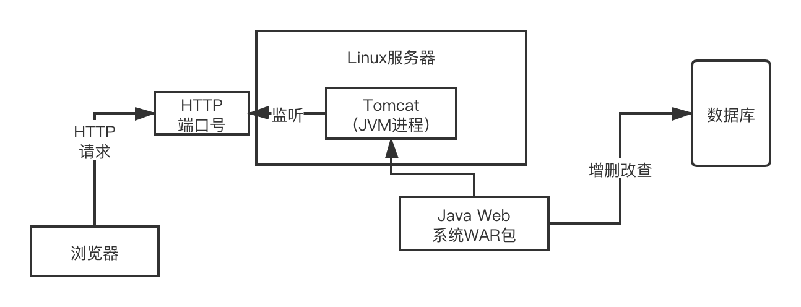
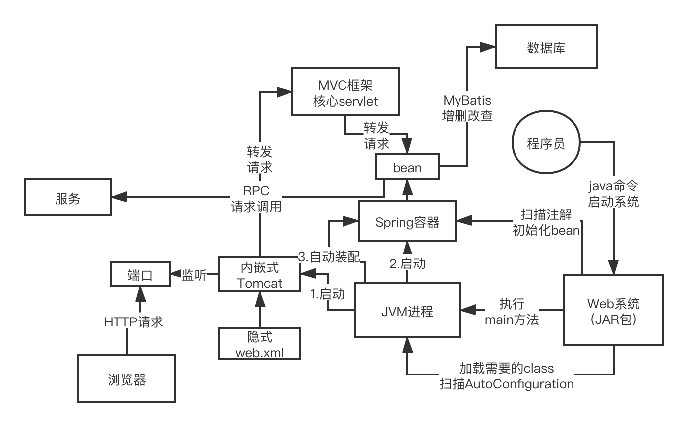

# Java开源框架体系源码学习思路

- 学习顺序：spring boot源码开始，spring源码，spring mvc源码，mybatis源码，spring cloud alibaba规范的源码，dubbo源码
- 微服务：spring boot + spring cloud
- 核心：任何的系统或者服务启动，一定是通过spring boot来启动的，启动web容器，spring容器，自动装配，spring mvc，spring管理的一大堆的bean，mybatis，spring boot自动装配的一大堆三方框架的bean。远程调用则是使用spring cloud alibaba里面的dubbo

# SpringBoot 运行原理

## 以前的Web 系统运行原理

-  Web服务部署：
  - ① 按 tomcat 规范书写相关**映射配置**：哪些**http 请求**交由哪个 **severlet 的类或 filter**处理
  - ② 开发好的 Java web服务的 War/Jar 包，放入 Tomcat 指定的磁盘目录下
  - ③ 启动Tomcat 服务
- Tomcat：一个 JVM 进程的 java服务（解压缩一个 tar 包，入口代码就是 tomcat 的 main 方法）。
  - ① 启动后，将指定目录下的服务 war/jar 包，加载到tomcat 的 JVM 进程中。
  - ② 并对外监听一个 HTTP 端口号

## Spring Boot运行原理

启动系统：执行 main 方法，即`SpringApplication.run(xxx.class, args);`。

- 启动内嵌的tomcat作为web容器
- 将项目类、依赖的第三方类加载进 JVM 进程中。

- 

直接运行main方法，main方法会通过SpringApplication来进行启动，此时必然会干的几个事儿包括了，启动内嵌的tomcat作为web容器，初始化spring容器，基于自动装配把第三方框架的bean都初始化好注入spring容器，spring容器把所有打了注解的自己写的bean都初始化好放到容器里，包括了spring mvc的controller，mybatis的mapper

 

而且往往会把自定义的bean跟第三方框架的bean进行自动注入

 

最后tomcat启动完毕，可以接收http请求，spring容器和你自定义的bean，第三方框架的bean，全部初始化好，依赖注入好，spring mvc到spring到mybatis到其他框架，随时可以正常工作

 

往tomcat发送http请求，系统run起来